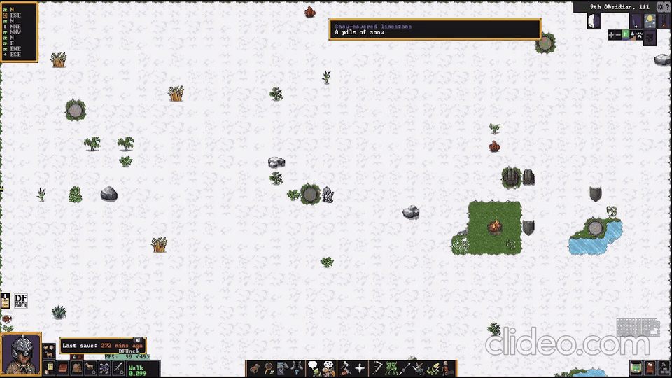
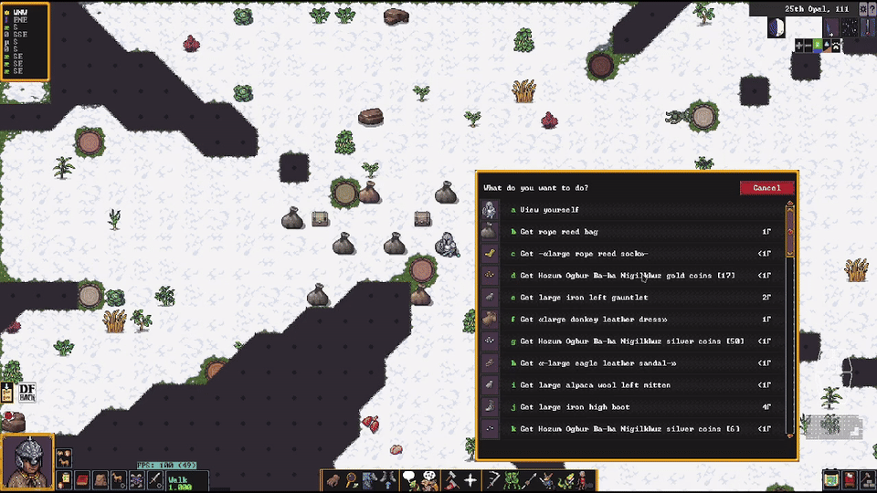

# Adventure mode

## Adventure mode features

### **`adv/auto-save`** 
Save adventurer mode automatically. `adv/auto-save enable 20` to save every
  20 minutes, which is default. 1 hour must pass in-game between autosaves.

### **`adv/map-travel`** 
Allow clicking to travel more than 1 tile in fast travel, like in
  non-fast-travel.

### **`adv/reveal`** 
Adventure mode reveal only when not in combat. You can easily navigate around
  a castle, dark goblin pit, dwarven fortress, or find a lair, and then not get an advantage in
  combat. It automatically re-enables when you leave fast traveling.

### **`adv/always-be-satiated`** 
Automatically eat and drink (non healing potions) when not in
  combat.

### **`adv/keep-inventory`** 
Automatically reopen the inventory and scroll to the last position
  when you use it.

### **`adv/appraiser`** 
Item values appear directly below each item's weight in the inventory and pick-up lists, at
  the precision a fortress broker gets: no Appraiser skill shows only `?`, ratings 1–5 show
  estimates rounded *up* the 1-2-5 ladder (140☼ → `~200`, 501☼ → `~1000`), 6–10 two
  significant figures (`~350`), 11–14 three
  (`~347`), and Legendary (15+) is exact. The skill
  trains as an adventurer plausibly would: +200 xp for a *completed purchase* with a partner
  you haven't traded with before (goods must actually reach your hands), +10 xp for handling
  a coin minting you haven't seen, checked once per in-game day — judged against rolling
  last-20 lists (persisted in the save) so the checks stay cheap.

### **`adv/inventory-display-weight`** 
Show every item's weight in the inventory list and the pick-up menu.

### **`adv/inventory-search`** 
Search the inventory list (Alt-S) by item description, material or type.
  Magic words: `heavy` sorts by weight, `equip`/`equipped` shows equipped items
  (hands always first, then strapped weapons/tools, containers last), `food` shows food and drink (drinks, food,
  healing drinks, healing food, then ethics-refused sapient flesh; containers
  excluded), `healing` shows food/drink with beneficial syndromes. One-click presets on the
  bar type them for you: `[Food] [Heal] [Book] [Heavy]`. The unsearched list
  displays in the equip order by default. keep-inventory reopens keep the filter.

### **`adv/travelling-hunger`** 
Show how many meals, drinks and 8-hour sleeps you need on the fast-travel screen's top row.

### **`adv/heat-ice`** 
Sort "heat ice" / "heat snow" options to the top of interact menus.

### **`adv/fort`** 
Do fort jobs in adventure mode — the self-contained, overlay-based successor to
  the retired `adv/advfort` (a community rework of DFHack's `gui/advfort`): jobs
  trigger on CAREFUL move or an adjacent click; Smooth/Engrave really smooth
  (designation + tiletype fallback); Fell Tree really fells trees (axe-skill-timed
  work, one log per trunk tile, Wood Cutter exp); recipes default to your civ plus
  the site owner's, with permitted custom workshops tagged by owning civ; the
  "you haven't acted in a while" prompt is auto-dismissed. The menu lives on the left border as
  a real overlay: nothing else is intercepted, so right-clicks and the native
  toolbar work directly and the window never blinks closed and reopens. At most
  ONE auxiliary panel opens to the menu's right at a time — the build picker
  (with its materials section built into its bottom), the workshop job menu, or
  a job's materials list — each searchable like fort/dig-building; picking a
  specific item for a slot opens a modal picker that takes complete focus until
  chosen or canceled (Esc/right-click). A job engine pumps work automatically
  (jobs can't start and silently stall), cancels the job if you leave its reach
  instead of orphaning it, auto-resumes interrupted-but-valid jobs, and sweeps
  stuck leftovers when the tool opens. Mouse job clicks are same-z only — the
  floor seen through a channel is walked to, not channeled (Ctrl+D/E for jobs
  below/above); standing inside a planned building's footprint is fine (the job
  anchors at your tile and you're stepped off a finished building that would
  seal you in); Use Workshop never captures a click or opens its menu unless
  you stand within 1 tile of the building's center, where jobs can actually
  run. On the map, Enter does the selected action at the look cursor, opening
  look mode first if it isn't up. Ctrl+Q quick mode, Shift+R/T cycle jobs.
  `adv/fort` shows, `adv/fort hide` hides, jobs keep running.

### **`adv/exhaustion-meter`** 
Combat-exertion bar with the native blood meter's manners and placement:
  invisible while you're fine, appearing in the blood meter's bottom-left
  corner once exertion matters, empty = you collapse. Tracks the counter built
  by attacking/sprinting/jumping that knocks you over mid-fight (DF shows no
  meter for it): yellow at Tired (2,000), red at Exhausted (4,000), empty at
  the ~6,000 falling-over point; decays when you stop exerting. Overlay
  `adv/exhaustion-meter.meter`, enabled by default (gui/overlay moves it).

### **`adv/posession`** 
[Regain your weapon] button on the "Who will you attack?" screen while you are
  struggling over possession of a weapon (grabbed from you, or stuck in someone
  pulling on it): one click selects whoever shares the weapon with you and
  initiates the native possession-struggle Wrestle attack. Dormant otherwise;
  overlay `adv/posession.regain`, enabled by default.

### **`adv/keep-talking`** 
Automatically reopen a conversation you are participating in.

### **`adv/read-the-map`** 
Allow hovering over sites to learn about them in fast travel.

### **`adv/world-map-features`** 
Middle-drag the travel map to pan it, and search everything your adventurer
  knows from a bar centred on the top row (Alt-F): sites you have heard of, people (placed
  where the world says they are, since a name reaches you with its story), your bestiary,
  regions, groups, carried rumours and artifacts kept or held by what you know. Rows show a category, distance
  and bearing; clicking one types its name into the bar, and whenever the text exactly names
  something the list folds away and the map draws a dotted line to it (the line is purely a
  reading of the bar -- clear the text and it goes), ending in a bordered card describing the
  target: read-the-map's own hover card for a site or region, one of the same shape for
  anything else, drawn at the map's edge when the target is beyond it. Typing a TYPE finds everything of it you know -- `vault`, `rabbit devil`,
  `high elf` (which also finds high elf sites); sites and civilizations always carry a
  bearing, and the exact name of an undiscovered site, artifact or person points at it too.
  Names match in either rendering (translated or native), first-and-last-name is enough
  without the epithet, accented letters are typed as plain ascii, and true names learned
  from slabs are searchable -- a demon is findable by what its slab calls it. On the
  world map, clicking a site types its name in. `site:`/`person:`/`beast:`/
  `region:`/`group:`/`event:` narrows the search. DF has no camera for this map, so the pan
  moves what DF thinks the centre is (`travel_origin`) only between update and render, and
  moving (or Esc) drops it -- `world-map-features recenter` if one ever sticks. The pan
  stops at the world edges: a centre outside the world crashes DF.

### **`adv/right-click-move`** 
Right clicking (if it gives no other options) automatically
  initiates movement, dismissing when the game annoyingly asks for two confirmations. Saves 3
  mouse clicks / key presses for a basic action.

### **`adv/grab-stacks`** 
One click grabs a whole stack. Clicking a stack in the pickup menu
  ("Get copper coins [512]") normally opens a mouse-only "Pick up how many?" screen — an
  extra click for the answer that is almost always "all of them". With this running, clicking
  a stack anywhere *except* its [N] count skips that screen and takes the full stack; click
  the [N] itself to choose an amount as before. On the amount screen, Enter or any letter key
  now accepts the shown number too.

### **`adv/enemy-recenter`** 
While you're in combat (by the same judgement `adv/reveal` and
  `adv/always-be-satiated` use), a "Recenter on enemy" button appears directly above DF's own
  "Recenter on yourself" button, wearing the same graphic. Click it and the camera jumps to
  the foe that put you in combat, with a selection box (`fort/dwarf-rts`'s art) flashing on
  that unit; multiple foes cycle click by click. DF's own button right below takes you home,
  so the pair reads as one rocker: enemy above, yourself below.

### **`adv/watch-their-blade`** 
The attack screens show a combat summary under each name — every
  candidate on the "Who will you attack?" chooser, and your target on the attack
  screens after you pick: their wounds ("Faint, Heavy Bleeding"), worn armor
  ("iron greaves, iron breastplate") and what they are holding, by hand ("Left
  hand silver carving knife, right hand copper whip") — including sheathed
  weapons. Pick your target, and your fight, with open eyes.

### **`smooth-movement`** 
Smooth camera panning in adventure mode, and smooth movement for
  creatures and the player in adventure mode. (A C++ plugin rather than a script — install it
  with `make install`.)

### **`adv/fear-no-goblin`** 
Fast travel into, out of and past goblin dark pits. DF refuses travel while you stand in one
and bumps you off the world map when your route crosses one; this presents every pit within
one world tile (tracked even mid-travel via your army's position — pit clusters form walls,
so all of them must open at once) as a town for exactly as long as you are playing. The patch
lifts the moment you leave the play screen, restores on world unload, and the real site types
are recorded in dfhack persistence *inside the save itself* before anything is touched — a
save that catches the patch necessarily catches the recovery record, and the next load heals
the world automatically. Always-on via its overlay; `adv/fear-no-goblin stop` pauses it.

### **`adv/im-sure`** 
Automatically dismiss "you haven't acted in a while" for long-running move
  commands.

### **`adv/makeown`** 
Recruit the selected unit into your party without asking them — the mercenary who won't take
your money, a prisoner you freed, somebody else's war dog, a goblin who just lost a fight. They
join as a full core party member: tactical-mode controllable, and kept when you retire and
unretire. `-extra` makes them a follower you can't take control of (`advtools party` promotes
one later), and `-pet` an animal companion — automatic for anything that can neither speak nor
learn. Hostility is cleared rather than ignored, so a unit recruited mid-fight actually stops
fighting: invader/ambusher/visitor flags, the army controller, the enemy status cache and every
Conflict activity are all dropped. Units with no historical figure get a nemesis record created
the way DFHack's own `bodyswap` does it, and are pulled out of their site's populace list so
they don't turn up twice after you travel. `-unit <id>` targets by id; `-remove` dismisses them
again, as does `gui/companion-order`'s Leave order. The vanilla talk menu usually won't offer
"part ways" — nobody signed a join agreement, they are in your party by data rather than by
diplomacy.

## Adventure mode embark features

### **`embark/adventurer-values`** 
Modify adventurer needs easily when you create your adventurer
  — so you can make a barbarian who loves to fight or avoid the impossible-to-satisfy Intense Need
  For Family (without memorizing which values affect which needs, where they are in the list,
  etc).

### **`embark/adventurer-default-items`** 
Automatically give you a decent starting gear loadout
  when creating an adventurer, and let you switch metals on your gear more easily.

### **`embark/adventurer-map`**
Show information about sites on the world map during adventurer creation. Clicking on a
site changes your origin to there, if possible.

