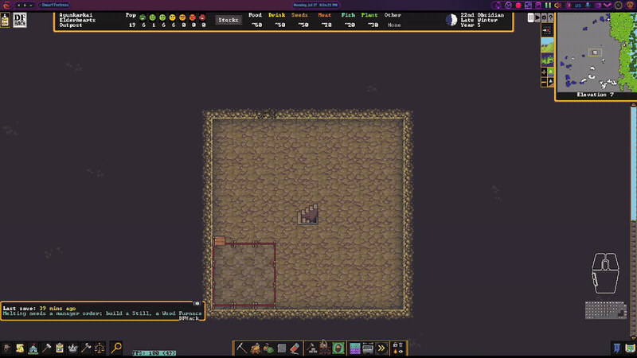
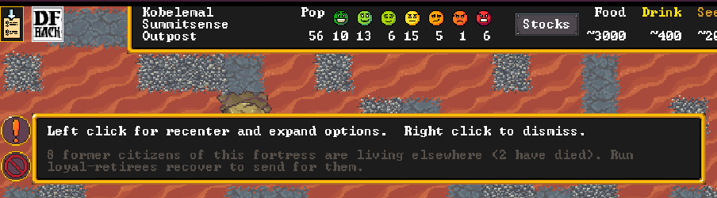
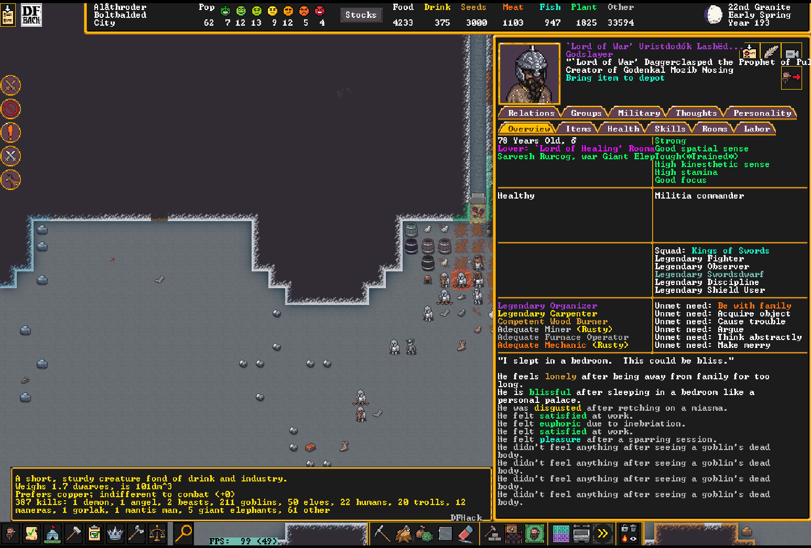
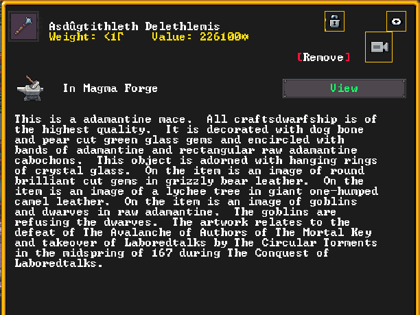
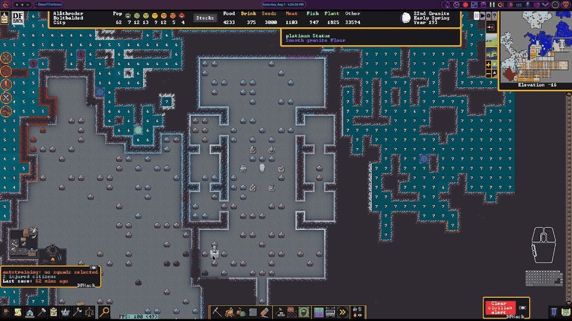
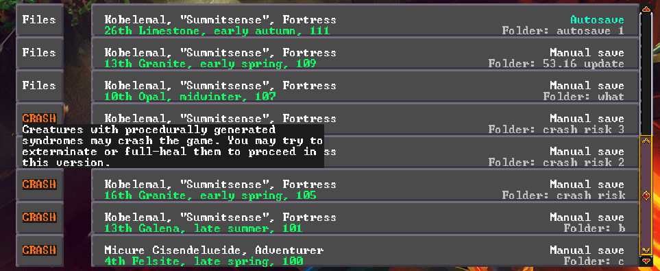

# Fortress mode

## Mining, Building, and Zones

### **`fort/dig-shapes`**
Right-click to dig; drag shapes that automatically become staircases, constructions, mining,
chopping or removal.

### **`fort/dig-building`**
A searchable building picker while digging that drops you straight into DF's placement flow.

### **`fort/right-click-cancel`**
Drag to designate, right-drag to erase, right-click to cancel — for every designation and
build tool.

### **`fort/plan-tile`**
Drag to place a whole grid of a building at once while planning, tiled by its footprint so
copies sit edge-to-edge.

### **`fort/stockpile-place`**
Drag to create a stockpile, expand a selected one, or erase tiles from any pile.

### **`fort/binnable-stockpile`**
Stockpiles can be toggled on/off with one click, set to all meltables, binnables, food, or
drink, and easily set allowed quality. The meltables pile only accepts the metals your civ
works, so adamantine, divine metals and mod metals never reach the smelter.

### **`fort/stable-stockpile-bins`**
Keeps the max bins/barrels/wheelbarrows you set on a stockpile from silently resetting the
next time anything touches its filter. Caps DF can no longer honour — the container stopped
applying, or your number no longer fits on the pile's tiles — go back to being DF's, as does
a pile you give no type (the "None" icon, or clearing it out in Custom settings).

### **`fort/auto-tomb`**
Drops the right zone onto furniture: a tomb on every coffin, a pasture on every nest box.

## Fortress Management

### **`fort/workshop-tools`**
Puts a `+` on every queued workshop task that queues another one just like it, and sorts
a shop's "Add new task" list so the jobs you can actually do come before the ones you can't.

### **`fort/quick-order`**
Type plain text on the Work Orders screen to create a legal manager order, with "keep N in
stock" repeats. Only offers subtypes your civilization actually knows how to make.

### **`fort/planner-orders`**
Warns of planned buildings nothing produces and offers the orders to make them. With a hospital
up it also stocks the supplies one needs, traction benches included — the bench and its table,
mechanism and chain each get their own ask.

### **`fort/labor-groups`**
Tidies the Labor screen and creates any missing crafting work details.

### **`fort/auto-name`**
Names each migrant wave to share a starting letter (wave 1→A, 2→B, …), gender-correct. A name
it hands out is never one already in use by anybody in the fort — if the pool ever runs dry it
numbers them instead (Aulus II, Aulus III, …).

## Military & Squads

### **`fort/dwarf-rts`**
Command squads like an RTS: pick with number keys, click to move or attack, drag a box to
order a group.

### **`fort/military-labor`**
Keeps the "Military" work detail matched to your standing squads.

### **`fort/training-barracks`**
Marks one barracks as the fort's training barracks and assigns every squad to train there.

### **`fort/squad-buttons`**
A Squads-screen button that selects or deselects all squads.

## Animals

### **`fort/auto-pasture`**
Auto-pens new tame animals, warns when a pasture is overcrowded, and adds graze/butcher
buttons to caged animals.

### **`fort/butcher-shop`**
Bulk-marks animals for slaughter, grouped by species and sex, with last-breeder warnings. Young
get their own rows and stay hidden until you ask for them (Ctrl-Y).

### **`fort/animal-training`**
Assigns a trainer to many caged animals at once.

### **`fort/wild-animal-train`**
Marks a wild animal for taming, so it's trained the moment it's caught.

## Automation

### **`fort/idle-smiths`**
Lets idle dwarves work the forge to satisfy their craft need, picking legal metals per item.

### **`fort/auto-mandate`**
Fills Make mandates with cheap materials (even minting coins) and prioritizes the work.
Each order it queues is announced — who mandated it, and what was ordered.

### **`fort/auto-elf-chop`**
Keeps tree-cutting under the elves' yearly limit by designating the nearest trees itself.

### **`fort/adamantine-hospital`**
Stops the hospital spending adamantine on bruises. DF gives a hospital no material filter, so
dressings and sutures happily consume adamantine cloth and strands. This watches the job list
and, the moment a treatment job has claimed adamantine cloth or thread, forbids that item and
cancels the job — the hospital re-issues the treatment and reaches for ordinary cloth, and
nothing is consumed. `adamantine-hospital release` hands the thread back to your smelter.

### **`fort/loyal-retirees`**
Brings a retired fortress's citizens home when you reclaim it. The roster is kept current as
dwarves join and leave, so whatever the fort looked like when you retired is what gets
summoned back — everyone still alive, however far they wandered.

DF only turns an off-map historical figure back into a real unit when an army carrying them
arrives, and armies can't be fabricated. So this fakes a diplomatic mission for one of your
nobles, lets DF mint the army for it, and puts the returnees aboard: they come back as their
original selves, with their skills, wounds, clothing and inventory intact. Progress is
reported in DF's own announcement log.

`loyal-retirees migrate <hf_id>...` uses the same machinery to summon anyone alive in the
world by historical figure id, whether or not they ever lived here.

### **`fort/broker-ready`**
Frees a soldier broker to trade, then puts their squad back on duty afterward.

### **`fort/rusty-legends`**
Keeps skill rust off a retired adventurer's every skill — matched on the nemesis
`ADVENTURER` flag, never a name or a skill count — and off any citizen's legendary
skills. Everything else rusts as normal. Swept once a game season. There is no stock
DFHack tool for this.

## Information

### **`fort/creature-description`**
Shows a creature's full description (great for forgotten beasts) with a categorized kill
list — each megabeast type by name, the cursed called out ahead of everything sentient
("1 goblin vampire, 2 kobold necromancers, 1 weremoose"), and sentient kills split by caste
("27 orcs, 9 orc champions, 5 illithids, 2 ulitharids"), with male/female castes grouped
together.

### **`fort/item-description`**
Shows an item's full description instead of DF's truncated box.

### **`fort/statue-redirect`**
Opens a statue's full item description, and adds a Remove button to built items.

### **`fort/clickable-noble-names`**
Makes the dead space on the Nobles screen live: click a noble's row to open their sheet
and follow them, or click one of the office/bedroom/dining/tomb icons to jump to that
room. DF's own assign and symbol buttons still work — the row is measured from the
render, so those blocks are handed straight back to DF.

### **`fort/clickable-squad-members`**
On a squad's details screen, clicking anywhere on a member's row — portrait or name — opens
that dwarf's sheet and follows them instead of offering to replace them. Clicking again,
while their sheet is the one on screen, falls through to DF's position-assignment list: see
who this is, then replace them. Empty positions are untouched.

## Searchable Lists

### **`fort/noble-symbol-search`**
Adds search to the noble symbol-assignment list of tens of thousands of items.

### **`fort/squad-equipment-search`**
Adds a search box to the squad-equipment item picker.

### **`fort/announcement-search`**
Adds search to the huge Announcements settings list.

## Notifications

### **`fort/agitated-animals-notification`**
Names the agitated animals by species instead of a bare count; shift-click attacks them all.

### **`fort/enemies-inside-notification`**
Warns of enemies inside the alert burrow; shift-click sends selected squads to attack.

### **`fort/trader-notification`**
Counts down how many days the trader is ready; click to jump to the depot.

### **`fort/empty-labor-notification`**
Warns when a restricted work detail has nobody who can actually do it. Stays quiet while
`autolabor` or `labormanager` is enabled, since those assign labors themselves.

### **`fort/needs-tomb-notification`**
Alerts when a dwarf dies with no tomb, or when anything is haunting the fort — a ghost counts
whether or not it was ever a citizen. Click for a death browser with cause, kills and a
clickable family tree, and queue memorial slabs in bulk.

### **`fort/civ-alert-notification`**
During a civilian alert, warns who's still outside the safe burrow; click to find them.

### **`fort/raid-notification`**
Tracks squads out raiding with a rough ETA, and unsticks them weekly.

## Embark

### **`fort/embark-prep`**
Prepare-carefully buttons that give a dwarf the office skills, plus a preferences view.

## One-time-commands

### **`fort/civilian-militia`**
Packs office-holder civilian squads into ready and reserve squads on command.

### **`fort/cheatmine`**
Instantly finishes all designated digging and any planned staircases (cheat).

### **`fort/force-more`**
Forces attack events the stock `force` can't, like real forgotten-beast cavern attacks.

### **`fort/destroy-forbidden`**
Destroys loose forbidden items lying on the ground.

### **`fort/clear-flows`**
Clears miasma and other flow clouds — a quick FPS fix.

### **`fix/raiders`**
Rescues squads and soldiers stuck on off-site raids.

### **`fort/raid-status`**
Reports raiding parties and a rough travel estimate, and retrieves stuck units.

### **`fort/caravan-teleport`**
Teleports a stranded merchant caravan back onto the depot.

### **`fort/worldgen-setup`**
Sets up a fresh test world: selects every installed mod and maxes the civilization/site
sliders from data, so only the Create-world click is left to you.

## Miscellaneous

### **`fort/gen-world`**
Drives world creation from the title screen, writing the mod list and all five sliders as
data and clicking only the buttons that have no data equivalent.

### **`fort/ha-census`**
Reports a freshly generated world's population at years 1/25/50/75/100, civ counts, sites and
castles, and the terrain each civ settled. Run it straight after generation, before saving.

### **`fix/old-saves`**
Marks old-game-version saves on the title screen's Continue Game lists — DF itself only tells
you after you load. Every save last written by an *older* game version than the one running
gets its "Files" button repainted: a red **CRASH** when loading would cross a known
backwards-incompatible build (3600, 3602 — hover the stamp for the workaround: procedurally
generated syndromes may crash, exterminate/full-heal the carriers), or a yellow **!OLD!**
when it's merely older and expected to load fine. The version is read from each save's
`world.sav` header (DF's title-screen data doesn't carry it), and rows are identified by the
save's folder name so same-named copies of a world can't be confused. Run the command bare at
the title screen to print every save and its version.

