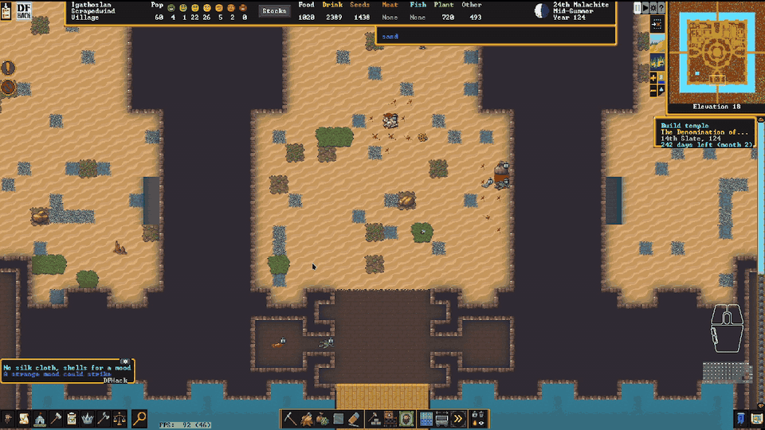
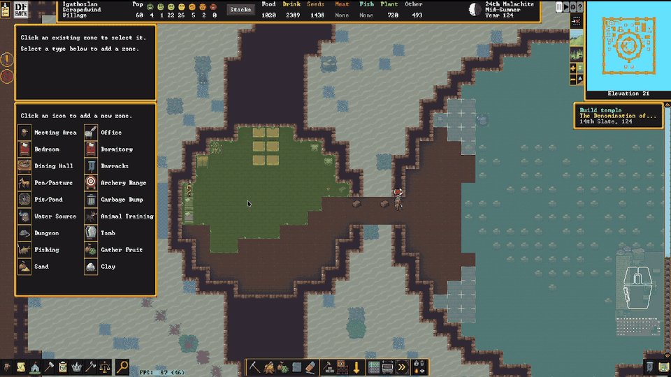

# Fortress mode

## Mining, Building, and Zones

### **`fort/channel-safely`**
Channel a big hole without caving your fort in. Every channel designation is suspended the
instant it appears, then fed back to the miners a few tiles at a time in an order the tool can
prove is safe: at most eight tiles out of the blueprint at once, never two of them touching, and
each one picked with the previous ones imagined as already channelled out. A tile is only let
out if digging it leaves nothing without support — support runs along the four sides and up from
the rock below, never through a corner — and if every other designated tile still has somewhere
to stand that connects out of the excavation. Tiles that are out get restricted traffic so
nobody wanders onto them, and their old traffic setting is restored afterwards. Smoothing beside
a channel goes first: a tile waits while any of the eight around it is still designated for
smoothing or engraving, or has a detailing job outstanding, since cutting the floor away first
only sends the detailer to a hole and gets the job cancelled. Detailing on the excavation itself
does not count — a tile designated for both channelling and smoothing loses that smoothing to the
dig whatever the order, so waiting on it would only deadlock. A shape with no
safe order, like a ring drawn around floor that is not itself designated, simply stays planned.
Only tiles a miner can actually get to are let out — revealed, and with somewhere to stand:
its own tile if that is reachable (a staircase is its own way in), a neighbour at its own level,
or a hole with one of the fort's ramps under it, which is how a miner walks back up into a level
that has already been channelled out — which keeps a designation drawn across undug rock from filling the working set
with tiles nobody can reach; when none of it can be reached yet, `status` says so rather than
blaming the shape. Priority 1 designations are never touched, and
`fort/channel-safely why <x> <y> <z>` explains any tile's verdict. Enabled by `magnus-scripts`.

When a pass can prove **nothing** safe to dig, that now raises a line in DFHack's notification
panel — *"23 channels blocked: smoothing beside them first"* — with the reason in the line and a
click that steps through the refused tiles. Held designations look exactly like working ones, so
without it a fort can wait a season on a blueprint nobody was ever going to dig.

### **`fort/planned-smoothing`**
Smooth a room before you have finished digging it. A smooth designation only sticks to tiles
that are revealed, so the part of your box that lands on undug rock is silently thrown away —
this remembers those tiles and lays the designation down once each one is a revealed floor of
natural hard stone with nothing already smoothed and nothing built on it, using DF's own rules.
Mining comes first: rock beside a fresh excavation is revealed as a wall long before anybody
digs it out, and smoothing that face is work a miner cuts away an hour later, so the tile waits
until mining has actually happened in it. Tiles that can never be smoothed — soil, constructions,
or a tile whose outstanding job is a staircase, a ramp or a channel — are forgotten rather than
held forever. The eraser takes plans back the same
way it takes designations back. Plans live in memory only and do not survive a reload, by
design: a box you dragged a minute ago is not a standing preference.

Smooth designations are also redrawn — DF's full-tile wash is replaced by a small triangle in
the corner of the tile, the shape DFHack marks damp digs with, in gray: bright for designated,
dark for planned and still waiting on the rock. A tile keeps that marker once its designation
becomes a job, which DF otherwise redraws its own way (it clears the tile's designation flag the
moment it posts the job), so a room looks the same from the drag until a dwarf takes the work —
at which point DF's flashing takes over and says somebody is on the way. The wash is only taken
away when smoothing is the one thing designated on the tile: a tile also marked for mining keeps
DF's art and just gets the triangle drawn over it, and hidden tiles are never drawn on at all.
Engrave designations keep DF's own graphic. `art off` puts DF's own designation art back and
leaves it alone.
`fort/planned-smoothing` reports what is planned, `clear` forgets it, `now` runs a pass
immediately. Enabled by `magnus-scripts`.

### **`fort/builder-burrow`**
Turn a burrow into a district. Pick a burrow (only those on a single z-level are listed, under
the name DF shows them by; the burrow is deleted once its blueprints start), a preset (hovels, 2x2 or 3x3 housing, luxury
housing, varied housing, noble quarters, tombs, temples, guildhalls) and when to build, and the
burrow is planned on the level you are looking at: roads grow from wherever the burrow touches
your dug floor, one segment at a time, each segment dressed with statue rows and plazas and lined
with districts as it is laid; a road with nothing along it is refused; a second pass fills the
leftover frontage; noble suites and guild complexes are placed as suites with one door on the
road. Then every room, road and hallway piece is started as a `fort/quickfort` job, so digging,
digging,
smoothing, engraving and furniture sequence themselves per tile, and the three blueprints that
want a given square wait for each other on it — a mine designation and a smooth designation never
share a tile, because DF works the smoothing, the mining never happens, and the wall just stays. Every wall around the plan is smoothed, and a room's walls are engraved as well — hallway
walls are left plain, so the carvings belong to the rooms. A noble suite goes further: the floor
under every piece of its furniture is engraved too, carved before the furniture arrives, since
nothing can be carved under a bed. Each stamp declares the activity zone its
room carries (`zone = 'b'`/`'o'`/`'h'`/`'T'` in the preset), and the blueprint gets a `#zone`
section next to its dig, smooth, engrave and build sections — bedrooms, offices, dining rooms and
single-coffin tombs. A catacomb or family tomb declares none and is left to `fort/auto-tomb`,
which zones each coffin separately; auto-tomb stands off any tile a running plan is about to zone,
so the two never race. New stamps added in the preset editor start with the zone their furniture
implies. The burrow's outer ring is never
dug and nothing outside it is touched. Confirming closes the picker immediately and plans in
the background, a slice of a frame at a time, so the game keeps running while the rooms appear;
progress goes to the console and the summary is announced in game. Only "apply now" exists so far. "New preset" and "Edit
preset" open a three-column editor: actions and the settings of the selection, the passes with
their districts and blueprints, and the blueprint library filtered by what is being edited; Enter
on a library entry adds it. Presets save to `dfhack-config/scripts/data/builder-burrow/presets.json`
and copy and paste as JSON through the system clipboard, the same JSON the browser prototype in
`prototypes/burrow-stamper` produces. `fort/builder-burrow status` lists the plans made for this
fort.

### **`fort/dig-shapes`**
Right-click to dig; drag shapes that automatically become staircases, constructions, mining,
chopping or removal.

A box that holds constructions **and** open tiles which would become walls is a **build**, not a
removal: drawing from a wall you already have up into the air above it is how you add another
course, so the walls in the box are left standing and the air is built. Air with nothing under it
— the sky caught alongside a bridge you are dismantling — would only ever become floor, and stays
incidental to the removal.

Where a staircase column tops out on an existing up stair, a **constructed** one gets an up/down
staircase built over it (a construction cannot be carved into) while a **naturally dug** one is
simply designated for a down stair — it is rock, and a miner cuts the down side into it for free
rather than spending a block and a mason on it.

### **`fort/dig-building`**
A searchable building picker while digging that drops you straight into DF's placement flow.

### **`fort/dig-replace-walls`**
Paint walls that should become constructed walls of your choosing. Reached from the
`fort/dig-building` picker as **Replace wall**, in the custom-tool band at the bottom.
A natural wall is designated for mining, a constructed wall for removal, and once the tile
is actually clear it is handed to `buildingplan` as a planned wall. Doors, hatches, furniture
and workshops are never taken down, and neither is a constructed wall carrying a masterwork
engraving — **nor one that already satisfies the filter**: taking down a conglomerate block wall
to build a conglomerate block wall costs a mining job, a hauling trip and a hole in the meantime
and gains nothing, so painting over one does nothing and says so. That judgement is made against
`buildingplan`'s own filter — the item form against its Blocks/Logs/Boulders/Bars toggles, the
material against the category mask and the named materials — so "turn these boulder walls into
block walls" still works with no material chosen at all. A filter carrying a heat-safety
requirement or a special is not judged, and those walls are replaced as before.

Materials are `buildingplan`'s, not the tool's. The panel shows the wall filter as it stands, in
`buildingplan`'s own words ("Any building material of microcline"), and its two controls — `f`
for the filter dialog and `b`/`l`/`o`/`r` for Blocks/Logs/Boulders/Bars — are `buildingplan`'s
own, editing `buildingplan`'s own stored wall settings. So a wall painted here is built out of
exactly what placing a wall by hand would build it out of, and a change made here applies to
walls generally.

The painter is an overlay rather than a dialog, so opening and closing it neither pauses the game
nor makes DF blank and redraw the screen; while it is up DF's designation tool is disarmed, so no
other map tool acts on the clicks it is taking.

A plan lasts only as long as the work does: cancel the dig on a painted tile by any means and the
replacement is cancelled with it — nothing is ever re-designated behind you — and the plan drops
itself as soon as the replacement wall is handed to `buildingplan`.

A rewrite of Little Fern Studio's [replace-wall](https://github.com/LittleFernStudio/replace-wall)
(MIT); see `LICENSE.md`.

### **`fort/rewall`**
Redraws every planned construction, to shake loose the ones deadlocked on a reserved item.

A wall that never gets built is usually waiting on itself. A hauler drops the block for one wall
onto the tile of the next one; that tile now holds an item another job has claimed, so DF suspends
the job rather than build over it — and the claim never lapses, because the job holding it is
suspended too, waiting on a tile of its own. Nothing in the fort resolves that: the walls sit
*planned* with their material lying right there. This removes each designation and puts back
exactly what it took away — same construction type, same tile, **same material** — and the fresh,
unsuspended job goes looking for it. Measured on a fort with 63 suspended walls: none left
suspended afterwards.

The material is the subtle part. Choosing a stone for a construction does not narrow the job's
filter; DF leaves that generic and *attaches the item you picked*. So the material is read off
the item already hauled to the site, not off the filter, or a wall with conglomerate waiting on
it comes back sandstone. `--any-material` gives that up deliberately, for when breaking the
tangle matters more than the stone.

`fort/rewall register` loads its warning without redrawing anything: a line in DFHack's
notification panel — *"7 constructions deadlocked — run fort/rewall"*. It counts **one shape**: a
suspended construction with an item on its tile that *another construction job has claimed*. That
tile cannot be built while the item sits on it, the item cannot be hauled while a job holds it,
and nothing in the fort ever undoes that. A wall suspended because another wall goes first is not
counted — that is `suspendmanager` sequencing, the fort working correctly, and a warning that
fires every season is one you stop reading. Clicking it walks you through the tiles. A deadlocked
wall is otherwise invisible: it looks exactly like a wall waiting its turn.

**It also picks materials that will not get stuck again.** A construction cannot be built while
loose items sit on its tile, and an item only leaves a tile if a hauler has somewhere to take it —
so in a fort with no stockpile accepting stone, blocks or bars, the blocks dropped along a wall
line sit exactly where the wall goes, forever, and a plain redraw hands the job back the same
blocked tile. So: if a loose item on the tile is what the job wants, **that** item becomes the
job's material, attached at creation — the job starts unsuspended with nothing to fetch and the
tile loses a blocker instead of gaining one — and whatever is left on the tile is moved to the
nearest reachable tile that is not a building site (`--no-clear` leaves it). Measured on this
fort: 16 sites blocked by unmovable items, 16 built from a block already lying on them, 48 items
moved aside, and *"Blocked by an unmovable item"* gone from the fort entirely.

Sites **nobody can reach** are named rather than redrawn — a pocket sealed by walls already
built, or a floor designated out over open air with nothing to build it from. No material and no
ordering fixes those.

`--material INORGANIC:CONGLOMERATE` (with `--item BLOCKS` for the form) overrides both the pin and
the old filter, for when the material a wall is carrying is itself the mistake.

It leaves alone anything a dwarf is actually building (taking a job out from under its worker is
how this repo has crashed DF), anything already part-built, and anything **`buildingplan` is
holding** — that filter lives in the plugin rather than in the building, so a redraw would throw
the plan away and leave a plain construction that takes the nearest rock. `-n` reports without changing
anything, `--suspended` limits it to the deadlocked ones, `-v` names each. The one cost is real:
a material already hauled to the site is released, so a hauler may carry that block elsewhere
before the new job claims it — the wall is not lost, only the trip.

### **`fort/repeated-flood-fill`**
Place a zone, stockpile or burrow **twice in the same spot** and the second one means *"and the
rest of the room"*. A 1×1 placement is DF's own; a 1×1 placement on the same tile again floods
the room in 2D. For burrows a 3×3 placed twice over the same nine tiles floods in **3D** — zones
and stockpiles each live on one z-level, so they have nothing to fill upward into.

The trigger is the *repeat*, never the tile, so clicking once inside a zone you already have does
nothing unusual — and the repeat has to **stand alone**: a 1×1 with a zone, stockpile or burrow
tile of its own kind in any of the eight tiles around it is left to DF, because clicking the same
tile twice is also what painting one tile at a time looks like when a click does not register.
It says nothing when it works, either; the room filling in front of you is the report, and only a
**refused** fill announces itself (too big to be a room, no floor to fill from, nothing to add). The fill stops at walls, open air and **doors**, the way DF's own rooms do —
without that a bedroom joins the corridor, the corridor joins the fort, and "the room" would be
the whole level. For a **zone or a burrow** what it fills is the floor **plus the walls and doors
around it**, corners included: a room is its shell as much as its floor, a bedroom that stops one
tile short of the wall is not the room you drew, and a burrow that stops there leaves the miner
outside the rock he was sent to dig. A **stockpile gets the floor only** — nothing is ever stored
in a wall, so a stockpile drawn over one counts tiles it can never use and holds them away from a
stockpile that could.

The 3D fill climbs the way a dwarf does — a staircase reaches the staircase above or below it, a
ramp the tile over its head — and brings each level's walls with it. Hidden tiles are never
filled, stockpiles also leave out tiles another building owns (doors included, since they cannot
share one), and too big a region is refused outright rather than half-drawn: a fort staircase
reaches every floor you have. The object you repeated on is the one that grows, so its name, settings and
assignments all survive.

### **`fort/right-click-cancel`**
Drag to designate, right-drag to erase, right-click to cancel — for every designation and
build tool.

### **`fort/plan-tile`**
Drag to place a whole grid of a building at once while planning, tiled by its footprint so
copies sit edge-to-edge.

A building DF places over a hole rather than on a floor — a well, which goes on open space or a ramp top — is placed by the same drag: the tile the mouse goes down on is one DF has already accepted, so its shape is what the rest of the grid is measured against.

### **`fort/stockpile-place`**
Drag to create a stockpile, expand a selected one, or erase tiles from any pile.

### **`fort/binnable-stockpile`**
Stockpiles can be toggled on/off with one click, set to all meltables, binnables, food, or
drink, and easily set allowed quality. The meltables pile only accepts the metals your civ
works, so adamantine, divine metals and mod metals never reach the smelter.

### **`fort/stable-stockpile-bins`**
Keeps the max bins/barrels/wheelbarrows you set on a stockpile from silently resetting the
next time anything touches its filter. Caps DF can no longer honour — the container stopped
applying, or your number no longer fits on the pile's tiles — go back to being DF's, as does
a pile you give no type (the "None" icon, or clearing it out in Custom settings).

### **`fort/auto-tomb`**
Drops the right zone onto furniture: a tomb on every coffin, a pasture on every nest box.

## Fortress Management

### **`fort/planeswalkers`**
Carry a whole fort between worlds. `fort/planeswalkers save` snapshots the current fort —
terrain (with veins, sand/soil, the grass cover — surface grasses and the
cavern mosses, fungi and lichens alike — and, on a same-size embark, the whole column down
through the magma sea and hell, re-registered on the destination's magma layer with the
layer's z band widened to the arriving sea and any magma pipe above it, so DF keeps rather
than drains it; the destination keeps its own demons), adamantine spires
carried as real spires with their contents — the demon wave waiting in each hollow, the
divine treasures, the encased horrors and magma/water pockets, each with its trigger tiles
and whether it already went off — while the destination's own spire contents under the fort
are removed before the terrain lands, so the load itself can never set them off —
constructions, buildings, stockpiles with their
settings, zones, items (with containment, quality, decorations, and maker), artifacts (named,
with their descriptions and full artifact status — value, quality and the Objects screen —
even on pedestals, with their engraved images redrawn from what they depict), room and
office assignments and the guildhalls/temples/libraries/taverns behind meeting areas,
squads (members, uniforms, ammunition, barracks) and their commander and captains, work details
and labour assignments, burrows, trees and shrubs (shrubs and saplings re-planted where they stood; every tree rebuilt with
its own trunk, branch and root layout and the exact tiles it stood on), the
manager's work-order queue, locked doors and hatches, retired adventurers
(unretirable on arrival), and every unit with skills, personality, appearance, family ties,
kill tallies by species, clothing ownership, and the surrounding historical-figure web — into
`dfhack-config/scripts/data/planeswalkers/<name>/`. On a fresh embark in ANY other world
(same or larger embark size), `fort/planeswalkers load <name>` wipes the footprint
(including the embark's own buildings — the wagon is dismantled, its supplies dropped)
and rebuilds the fort there, dwarves and all. Everything is stored as raw tokens, so worlds
with the same mod set restore near-losslessly; content the destination world lacks (modded
materials, procedurally generated races and their materials, a deity's divine gear, necromantic
secrets) is substituted with the closest equivalent or skipped with a report. Carried spires are laid
down as plain raw-adamantine veins, which survive retire and reclaim; their contents are carried
as DF's own hidden-fun-stuff records. Make a manual DF save before loading — there is no
rollback. An in-game announcement tells you when the save is written and when the fort has
been restored. Run it with no arguments for a walkthrough, or `help fort/planeswalkers` for
the full description. A fort restored into a larger embark than it came from is saved again
at its original size and area, so it keeps travelling to embarks of its own size. `list`,
`delete <name> --yes` (deletes only the snapshot folder), `spires` (re-arm the carried spires
on a fort restored before that pass existed), `repair` (re-registers and refills a magma
sea that drained after the restore — the one recovery still worth a command), `status`, and
`cancel` round out the set.

**Taking a party instead of a fort.** `fort/planeswalkers gui` asks the question first: the whole fort, or
these travellers? A party snapshot is a handful of chosen dwarves and what they carry — skills, attributes,
personality, **preferences**, **body size**, appearance, labors, relationships and every worn, wielded or carried item,
containers with their contents. Nothing about the destination map is touched: the travellers arrive in the
fort you are already playing, beside a citizen picked at random (a different one each load), and everything
else there survives. Extra loose items can be named on top of their gear — the anvil in the stockpile, the
artifact on its pedestal — while gear itself is never a question, since it always comes. Preferences are
written as raw tokens (`INORGANIC:STEEL`, `PLANT:PINEAPPLE:DRINK`) and looked up again on arrival, so a
material the next world has never heard of is dropped rather than pointed at whatever now sits at that
index; poetry, music and dance forms are skipped entirely, being works this world composed. `fort/planeswalkers
party [name] <unit id...>` does the same from the keyboard, defaulting to the selected dwarf.

**A round trip through a world that has never heard of your mods.** `killed_race` is an index into the
*current* world's creature list, so a dwarf who walks into a vanilla world loses every drow, orc and succubus
kill the moment she arrives — and the next save would read her kill list back out of the game and write down
only what was left. Anything a destination cannot represent is now **carried** instead: kept beside the fort
against the historical figure who earned it, and folded back into her record the next time she is saved, so
she comes home with her career intact. Preferences that name a material the world lacks are carried the same
way, against the unit. Verified on a 136-row kill list: 52 modded rows (415 kills) survive the round trip and
merge back without duplicating the 84 the game still holds.

### **`fort/forge-bars`**
The forge's "Add new task" list names every metal it could work as "iron (opens menu)",
whether you own a bar of it or not. This overlay paints the count over that tail on every row —
"iron (40 bars)", "steel (no bars)", "bronze (319 bars, 2 in use)" — read from the bars on the map
(forbidden bars are not counted; bars a job has already claimed are counted and noted), and the metals
you have none of are moved to the bottom of the list, in DF's order. Metalsmith's
forge and magma forge only. Auto-discovered by `overlay rescan`; `forge-bars` on the console prints
the same counts for the open menu.

### **`fort/workshop-tools`**
Puts a `+` on every queued workshop task that queues another one just like it, and sorts
a shop's "Add new task" list so the jobs you can actually do come before the ones you can't.

### **`fort/quick-order`**
Type plain text on the Work Orders screen to create a legal manager order, with "keep N in
stock" repeats. Only offers subtypes your civilization actually knows how to make.

### **`fort/planner-orders`**
Warns of planned buildings nothing produces and offers the orders to make them, along with the
standing orders a fort keeps forgetting — brewing, fuel, milling, containers, and one smelting
ask per ore as you find it. **Bronze comes straight from the ore**: hold a tin ore and a copper
ore and it offers the Smelter's "make bronze bars (use ore)" as a single job, skipping the two
separate smelts — gated on *an ore of* tin and *an ore of* copper rather than on named stones, so
changing which copper ore you are mining does not strand the order. With a hospital
up it also stocks the supplies one needs, traction benches included — the bench and its table,
mechanism and chain each get their own ask — and the chain ask, the one kept stocked rather than
made once, is held at *N chains of the metal it forges*, so the iron ones you already have never
hold a copper order shut. Some asks are standing preferences rather than
one-off gaps: say yes to cutting the rough-gem surplus once and it is handled from then on, one
Cut Gem job at a time, posted again whenever that one is finished and the pile is still over ten
— no second ask, and `planner-orders disable` hands it back. Adamantine is the same, and has to
be: its ladder — keep 3 raw boulders always, then 3 wafers, 3 thread, 3 cloth, 9 wafers for a
true throne, and the rest stays raw — counts the adamantine you have set *aside*, and a manager
order gated on a condition cannot see a forbidden wafer, so it would extract more to replace
what was merely reserved. One rung at a time, and only what that rung asks for.

### **`fort/labor-groups`**
Tidies the Labor screen and creates any missing crafting work details. The list ends with
*Animal Trainer*, then *Military*, then **Strand extraction** — the adamantine labor you go
hunting for the moment a vein turns up and never think about again, parked at a fixed place
at the very bottom with the custom-**I** icon, which nothing else here uses.

### **`fort/sort-locations`**
When you assign a new temple or guildhall, the deities and professions that have actually
*petitioned* for one are moved to the top of the list, in DF's order otherwise — instead of
sitting somewhere among sixty-odd entries that look exactly the same. Petitions are read from
the agreements themselves and filtered to your own site, so another settlement's guild never
pulls a profession up your list. *(No particular deity)* keeps its place at the head, and a
list already in the right order is left alone so nothing shifts while you read it.

### **`fort/choose-labor-icon`**
Pick a work detail's icon from a grid of the actual icons instead of cycling DF's little
selector one at a time.

### **`fort/auto-name`**
Names each migrant wave to share a starting letter (wave 1→A, 2→B, …), gender-correct. A name
it hands out is never one already in use by anybody in the fort — if the pool ever runs dry it
numbers them instead (Aulus II, Aulus III, …).

## Military & Squads

### **`fort/dwarf-rts`**
Command squads like an RTS: pick with number keys, click to move or attack, drag a box to
order a group.

### **`fort/military-labor`**
Keeps the "Military" work detail matched to your standing squads.

### **`fort/training-barracks`**
Marks one barracks as the fort's training barracks and assigns every squad to train there.

### **`fix/assigned-equipment`**
Frees gear the squad equipment lists refuse to offer.

Two things hide a perfectly good item from the uniform pickers. One is a *phantom assignment*: an id
left in `plotinfo.equipment.items_assigned` after the squad, uniform or soldier that claimed it is
gone, so the item belongs to a soldier who does not exist and nothing ever releases it — those ids
are moved back to the unassigned lists (ids whose item is gone are dropped). The other is *personal
property*: an item a citizen has claimed is skipped by the equipment manager outright while it sits
in the unassigned list looking available, so it never appears in the picker however hard you look —
which is how adventurer gear carried into a fort usually ends up unusable. Every piece of military
gear a citizen has claimed is reported, and `--unclaim` drops the claim so DF offers it on its next
equipment update. "Military gear" is the item types the equipment screen deals in — weapons, shields,
ammo, quivers, flasks, packs, and for the armour slots only real armour (`armorlevel > 0`) or an
artifact — so the clothes dwarves own are left to `cleanowned`, and a visitor's own sword is never
confiscated. Anything a squad, hunter, work detail or soldier still references is left alone. `-n`
reports only, `-v` names every item, and `--all-squads` widens the reference scan from your fort's
squads to every squad in the world.

### **`fort/squad-buttons`**
A Squads-screen button that selects or deselects all squads.

## Animals

### **`fort/auto-pasture`**
Auto-pens new tame animals, warns when a pasture is overcrowded, and adds graze/butcher
buttons to caged animals.

### **`fort/autobutcher`**
Replaces the stock `autobutcher` plugin and its GUI. One number per species -- how many
ADULTS you want -- instead of four (female kids, male kids, female adults, male adults),
and nothing is butchered until the herd grows past it: then males first, down to a floor
of four, then females. Click the number to type one, the arrows to nudge it, `[edit]` for
the per-species rules the plugin hardcodes -- keep the N oldest (so a herd can age while
every new adult goes to the butcher), infertile first, oldest or youngest first, war
animals last, a juvenile limit, a custom adult age. War-trained, chained and zoo-caged
animals are excluded from the reckoning entirely by default. Small numbers behave
differently on purpose: 2-4 keeps one male and the rest females and never butchers the
last breeding pair, 1 turns the left buttons into `[m] [f]` for which sex survives, and 0
turns them into a `[kids:cull|grow]` toggle. Marks it made it takes back off if you raise
a limit; marks you made by hand it never touches.

### **`fort/help-mood`**
Run by hand during a strange mood (`fort/help-mood`). If the fort cannot satisfy the mood it
says one thing and no more -- *"The gods are testing you"* -- because knowing what a mood wants
IS the blessing, and because by then the demand is already rolled: what you were short of is
`fort/moody-items-warning`'s question, and it answers it all the time. Otherwise it lists
one row per ITEM the mood needs, read from the job's own
filters, proposes the highest-value candidate for each, and lets you click any row to choose
from everything that fits. Where the dwarf's preferences and moodable skill settle it, it says
what is coming: *"...announces they will create a table!"* Then `[build selected artifact]`
forbids every other candidate in the fort -- including ones mined, butchered or woven while the
dwarf walks -- so DF has one legal choice per row and takes it, instead of the nearest boulder.
It never changes what the mood *asks for* — the requirement is the mood's own, and the panel
only helps you satisfy it. Requirements already hauled in are shown as claimed; candidates are
limited to what the dwarf can actually walk to and to what the fort can actually give — an item that belongs
to a building is never offered, since `flags.in_building` is clear on workshop contents and unforbidding one
does nothing (the forbid was never what stopped it); worn, part-used and forbidden items are shown,
labelled, and never chosen by default, and a block that was built into a wall or pillar says `BUILT INTO A
WALL` rather than a bare "unreachable" — it is still an item at that tile and still in your stocks, which
makes it look eminently walkable. And when the fort is short of what the mood wants,
`[delay work]` (Ctrl-D) buys the time to make it: the dwarf gets a burrow of nothing but their
own workshop, so there is no item they can reach and the mood holds where it is until you lift
it. Everything it touches is put back.

The mood line names the craft the mood claimed — "Gautier, Clothier, is taken by a fey mood!" —
since that is what decides the base material and whether the fort can supply it at all; DF fixes it on
`unit.job.mood_skill` when the mood begins, so it is known before a workshop is claimed.

The status line quotes the dwarf the way DF does — a fey or fell dwarf *screams, "I must have rock
blocks!"*, a secretive one *sketches pictures of* it, a possessed one names the artifact and trails off the
way DF does, *mutters, "The Flighty Shrine requires bars... metal..."*, a macabre one *broods, "Yes. I need
…"*. A dwarf never says the specific material: where the mood wants iron bars he asks for *bars... metal…*,
and only a requirement that is already generic ("rock blocks") is spoken as it reads.

Items the dwarf cannot walk to are listed last and marked `UNREACHABLE`, and the picker refuses to take
one — hiding them made the panel claim the fort had nothing when it held twenty-five blocks across a
chasm. Where an item was made is ignored: a foreign block builds like any other.

### **`fort/butcher-shop`**
Bulk-marks animals for slaughter, grouped by species and sex, with last-breeder warnings. Young
get their own rows and stay hidden until you ask for them (Ctrl-Y).

### **`fort/filter-other-units`**
Category filter buttons on the Units screen's **Other** tab, where the Dead/Missing tab
keeps its `[Show death cause]`: `[Friendly] [Wildlife] [Hostile]` are independent toggles
(none lit = unfiltered, so clicking one filters to just that and clicking a second adds
it), and `[Caged?]` cycles separately through *cages don't matter* → `[No Cage]` →
`[Caged!]`, so Hostile + `[Caged!]` is your prisoner list. The categories are DF's own,
read out of the `Cat` column it already draws rather than guessed again from unit flags.

### **`fort/animal-training`**
Assigns a trainer to many caged animals at once.

### **`fort/wild-animal-train`**
Marks a wild animal for taming, so it's trained the moment it's caught.

## Automation

### **`fort/idle-smiths`**
Lets idle dwarves work the forge to satisfy their craft need, picking legal metals per item.
Soldiers whose squad is under orders are left to those orders.

### **`fort/auto-mandate`**
Fills Make mandates with cheap materials (even minting coins) and prioritizes the work.
Each order it queues is announced — who mandated it, and what was ordered.

### **`fort/auto-elf-chop`**
Keeps tree-cutting under the elves' yearly limit by designating the nearest trees itself.

### **`fort/harvest-plants`**
Designates every ripe shrub standing in a Gather Fruit zone for gathering once a month, instead
of waiting for the zone to trickle a few tiles out at a time — vegetables and fruitless plants
included, not just what DF picks on its own. It uses DF's own mechanism: the same tile
designation the Designate › Gather tool paints, so DF posts and runs the jobs exactly as if you
had dragged the tool over the zone. Tiles already designated or with a gathering job are skipped,
so nothing is ever doubled up, and withered shrubs (`ShrubDead`, or a plant flagged dead) are never
touched. A `[Harvest]` button on the zone panel, below the three gather settings, turns a zone's
auto-designating off and on and acts immediately: on designates that zone's ripe shrubs there and
then, off clears the designations it painted (jobs DF already posted are left to run — pulling a
job DF owns has crashed this fort). It is on by default, and a zone with "Pick shrubs" switched off
is skipped. Only shrubs with something on them are designated — a plant with growths has produce
only while one is in *season*, and leaves and flowers are not produce — and its own designations
are re-checked daily and cleared when their season ends, so a summer berry patch is not still
designated in late autumn on bare twigs. Hand-painted designations are never cleared.

### **`fort/adamantine-hospital`**
Stops the hospital spending adamantine on bruises. DF gives a hospital no material filter, so
dressings and sutures happily consume adamantine cloth and strands. This watches the job list
and, the moment a treatment job has claimed adamantine cloth or thread, forbids that item and
cancels the job — the hospital re-issues the treatment and reaches for ordinary cloth, and
nothing is consumed. `adamantine-hospital release` hands the thread back to your smelter.

### **`fort/loyal-retirees`**
Brings a retired fortress's citizens home when you reclaim it. The roster is kept current as
dwarves join and leave, so whatever the fort looked like when you retired is what gets
summoned back — everyone still alive, however far they wandered.

DF only turns an off-map historical figure back into a real unit when an army carrying them
arrives, and armies can't be fabricated. So this fakes a diplomatic mission for one of your
nobles, lets DF mint the army for it, and puts the returnees aboard: they come back as their
original selves, with their skills, wounds, clothing and inventory intact. Progress is
reported in DF's own announcement log.

`loyal-retirees migrate <hf_id>...` uses the same machinery to summon anyone alive in the
world by historical figure id, whether or not they ever lived here.

### **`fort/broker-ready`**
Frees a soldier broker to trade, then puts their squad back on duty afterward.

### **`fort/rusty-legends`**
Keeps skill rust off a retired adventurer's every skill — matched on the nemesis
`ADVENTURER` flag, never a name or a skill count — and off any citizen's legendary
skills. Everything else rusts as normal. Swept once a game season. There is no stock
DFHack tool for this.

## Information

### **`fort/unit-attributes`**
An `[Attributes]` button on a unit sheet's *Other Skills* tab, above the Progress Bar toggles,
opening all nineteen attributes at once: current value, the highest that dwarf can ever reach,
and how far the value sits from the median for that creature's own caste in DF's steps of 250.
The window measures itself against what it is showing, so nothing is cut off at either edge,
and it does not pause the fort. Click any attribute for the list of jobs and skills that
exercise it — transcribed from the DF wiki, since the game does not expose that mapping at all,
and the panel says so.

### **`fort/thought-police`**
Counts the fort's recent bad thoughts and prints the worst, most common first.

The stress screen names the miserable dwarf; it never names the cause, and a hundred unit sheets is
not a diagnosis. This walks every citizen's emotions, keeps the ones from the last month (`days=N`),
and groups them by what happened rather than by which feeling it produced — "sad about X" and "angry
about X" are one problem to fix. `NeedsUnfulfilled` is broken out by the need that went unmet, since
that is the entire content of the row. Each row shows how often it happened, how many citizens had
it, how many have not got over it yet, and the harshest emotion DF attached to it with how hard that
bites on a scale of 1 to 8 — Annoyance (1), Sadness (2), Grief (4), Horror (8). The number is DF's
own: it divides a thought's severity by the emotion's divider to reach stress, and every negative
emotion in the game uses 1, 2, 4 or 8, so the same thought recorded as horror really does cost eight
times what it costs as annoyance. Fifty dwarves wanting a cup is a smaller problem than three
reliving a death. `-v` names the three dwarves who had it most, with the running
stress total each is carrying; `top=N` changes how many rows print.

What counts as bad is DF's own arithmetic, not a hand-written list of unpleasant-sounding emotions:
each emotion carries a `divider` DF uses to turn severity into stress, so a positive divider is a
thought that hurt. There is deliberately no "stress caused" column — DF does not record one, and the
`severity` field that looks like it sits at 0 on most unpleasant thoughts, witnessing a death
included, so anything computed from it reports a contented paradise.

### **`fort/creature-description`**
Shows a creature's full description (great for forgotten beasts) with a categorized kill
list — each megabeast type by name, the cursed called out ahead of everything sentient
("1 goblin vampire, 2 kobold necromancers, 1 weremoose"), and sentient kills split by caste
("27 orcs, 9 orc champions, 5 illithids, 2 ulitharids"), with male/female castes grouped
together.

### **`fort/item-description`**
Shows an item's full description instead of DF's truncated box.

### **`fort/statue-redirect`**
Opens a statue's full item description, and adds a Remove button to built items.

### **`fort/clickable-noble-names`**
Makes the dead space on the Nobles screen live: click a noble's row to open their sheet
and follow them, or click one of the office/bedroom/dining/tomb icons to jump to that
room. DF's own assign and symbol buttons still work — the row is measured from the
render, so those blocks are handed straight back to DF.

### **`fort/clickable-squad-members`**
On a squad's details screen, clicking anywhere on a member's row — portrait or name — opens
that dwarf's sheet and follows them instead of offering to replace them. Clicking again,
while their sheet is the one on screen, falls through to DF's position-assignment list: see
who this is, then replace them. Empty positions and the row's own checkbox are untouched.

## Searchable Lists

### **`fort/noble-symbol-search`**
Adds search to the noble symbol-assignment list of tens of thousands of items.

### **`fort/squad-equipment-search`**
Adds a search box to the squad-equipment item picker.

### **`fort/announcement-search`**
Adds search to the huge Announcements settings list.

## Notifications

### **`fort/agitated-animals-notification`**
Names the agitated animals by species instead of a bare count; shift-click attacks them all.

### **`fort/enemies-inside-notification`**
Warns of enemies inside the alert burrow; shift-click sends selected squads to attack.

### **`fort/trade-again`**
DFHack's "Move goods to/from depot" screen opens with nothing selected, so every caravan starts with the
same hunt through thousands of rows. This pre-selects the obvious ones as the screen opens: everything
**your own fort made** (not `foreign` — selling last year's purchases back is rarely the intent), plus
**loot**: foreign gear whose maker's race you are presently at war with and which has not traded here in ten
years is siege plunder, not a purchase (`trade-again loot off` to stop that; DF records no "I looted this"
bit, so this matches on `maker_race` against your civ's live war list, and your own civ's race never counts).
Selected items must be sitting at
**distance 0** from the depot, measured exactly the way the screen's own `dist` column measures it. Forbidden
items, artifacts and ethically banned goods are left alone, and items already *in* the depot need no help
since DFHack counts those as selected already. Selection goes through `dfhack.items.markForTrade`, so rows
come up ticked exactly as if you had clicked them and deselecting one removes the job normally.
`trade-again radius N` widens the catchment (persists with the fort); `trade-again` selects them now
without opening the screen; `trade-again status` says what would be picked. Hooks
`MoveGoodsModal:init` so the selection is made just before the screen reads its pending set.

It also **opens the window at the full height of the interface** instead of DFHack's fixed 46 rows — on a
tall screen that is a lot of list you were paging through for nothing — and at **whatever width you last
resized it to**, which the window records for itself. Both are class hooks, so a window already open picks
them up on its next render.

### **`fort/trader-notification`**
Counts down how many days the trader is ready. It also speaks up *before* they get there —
*"Merchants are coming to the depot"* — which is the window in which a caravan quietly fails to
arrive. With one caravan trading and another still walking in, the countdown reads *"…for 9 days
(more coming)"*.

Clicking takes the **next step of the trade**, whatever that is. While merchants are still on
their way it zooms to one who has not arrived, one per click, so you can walk the stragglers.
Once somebody is at the depot it opens the screen you would go to next: the depot's own panel —
the one clicking the depot opens — or, if you have nothing down there to sell, DFHack's *move
trade goods* window. Either way it asks for the **broker**, unless he is already standing on the
depot: sending him is what makes the panel worth opening, and it is the step that gets
forgotten.

The same line also sits on the **depot's own panel**, under the *Trade Depot* title: the screen
you are on while deciding what to send down there is the one that should be telling you how long
you have. It is the notification's own text, so the two can never disagree.

### **`fort/better-dfhack-trade`**
DFHack's trade UI is one small window with a tab bar — *Caravan goods* on one tab, *Fort goods*
on the other — and a trade is a comparison, which a tab switch is not. This opens it as **two
windows side by side**: what they are selling on the left, what you are offering on the right,
each a whole DFHack trade window with its own search, sort, filters and selections.

They open against the edges of the screen — four rows of margin at the top, three columns at the
left, three rows at the bottom — and stop short of the **minimap**, so the thing that tells you
where your depot is stays visible while you trade. The minimap's width is measured rather than
assumed (DF draws it itself, so those cells come back empty from the tile grid), and a fort with
the minimap turned off gets the full width. After that they are ordinary DFHack windows: drag
and resize them as you like.

It works by swapping the class DFHack's own *DFHack trade UI* button builds, so every way in —
the banner button, the keybinding — opens this instead, and turning it off in `magnus-scripts`
puts DFHack's own window straight back.

### **`fort/help-mood` notices**
Replaces DFHack's *"moody dwarf is claiming a workshop / can't find needed item"* with the
game's own words: **"Thåkut withdraws from society..."**, *"...works furiously!"*,
*"...keeps muttering..."* — the right line for the mood type, and the dwarf's first name
rather than "moody dwarf". **If the fort has no workshop of their craft it says so** — *"Dunstan,
Bowyer, has been possessed! They need a Bowyer's Workshop!"*, in red — because a moody dwarf who
cannot find their workshop wanders until the mood runs out and then goes insane, and DF never
mentions it: its announcement names the mood and stops. Magma forges and magma glass furnaces
count, and a craft with no rule for it says nothing rather than guessing. While they are fetching it keeps the mood's own line and counts what has arrived —
*"Thåkut withdraws from society... Claimed 3 items."* When they are stuck it names what they
are short of the way DF would, and a secretive dwarf *sketches* it rather than demanding it; past a week it counts the
days: *"Thåkut has sketched rock blocks for 7 days"*. Clicking follows them with the camera,
clicking again opens the planner. Turning it off in `magnus-scripts`
puts DFHack's own line back rather than leaving a gap.

### **`fort/mood-watch`**
The mood you have *not* had yet. *"A strange mood could strike"* — from DF's own
`mood_cooldown`, population and excavated-tile counters rather than a guess about three
months. Clicking opens a dialog in the fort's own voice — *"Our fortress has grown to attract the
attention of the gods..."* — with three answers: **Reserve a metal**, **Not this time** (back
for the next mood) and **Don't ever show this again**. Reserving one metal means — forbidding every other metal
bar in the fort, and *continuing* to forbid them, so bars smelted or traded for afterwards are
caught too (*"Ensuring slade is used for next mood"*). Only the bars it forbade are ever
released again, so your own forbids are safe. `magnus-scripts` turns the notice back on, and `fort/mood-watch gui` reopens the dialog once the
notice has been clicked away.

A reserve is **spent by the first mood**, whatever that mood turns out to want: once one begins its
materials are already rolled, so the reserve lifts itself and every bar it forbade is put back — leaving
it up would mean the *next* mood finds only that one metal legal. It also lifts for a mood that came and
went unwatched, spotted by `mood_cooldown` having risen since the reserve was made, and the check runs
from the notification itself rather than the sweep heartbeat, which a script reload or save/load can
leave stopped.

The sweep that keeps other metals forbidden runs from the notification as well as its heartbeat — a
reserve only steers anything while every rival bar stays forbidden, and bars keep arriving; with the
heartbeat stopped, 24 of one fort's 45 iron bars sat free under a slade reserve and the next mood duly
asked for iron.

### **`fort/moody-items-warning`**
Warns when the fort has none of a material a strange mood might demand — stone, logs, leather,
plant/silk/yarn cloth, metal bars, rough or cut gems, blocks, bones, shells, and raw glass in
any type you have produced. A mood asks the moment it starts, so a gap found afterwards is a
berserk dwarf. With stressed dwarves in the fort it also checks remains and bones, which a
macabre mood wants. The list is taken from DFHack's `strangemood` plugin and cross-checked
against the wiki, not from memory. Forbidden stock counts — a forbidden shell is one you have. It
warns at **fewer than three** rather than at none, since three is the most of one thing a mood
asks for and one bar of the metal it settles on is the same dead end as none, found a day
later: *"No shells; only 2 tanned leather for a mood"*.

The shells line only appears when somebody in the fort actually prefers a shell material: shells are
the one mood material chosen by preference rather than stock (a bone carver demands shells only if they
like a type of shell, bones otherwise), so a fort with no shell-lover can never be asked for one.

### **`fort/empty-labor-notification`**
Warns when a restricted work detail has nobody who can actually do it. Stays quiet while
`autolabor` or `labormanager` is enabled, since those assign labors themselves.

### **`fort/needs-tomb-notification`**
Alerts when a dwarf dies with no tomb, or when anything is haunting the fort — a ghost counts
whether or not it was ever a citizen. Click for a death browser with cause, kills and a
clickable family tree, and queue memorial slabs in bulk.

### **`fort/no-sparring-spam`**
Removes the sparring alert from the notification strip. Squads drilling refill that button
constantly, so it sits there permanently and pushes the alerts you want to read — a failed
job, a guest, a real fight — out of the way. It waits for the bout to end first: the button
goes only after three seconds with no new sparring report, so a squad still trading blows is
never interrupted and DF is not left rebuilding a button that keeps vanishing. Only the button
goes: every sparring blow is still filed in the units' combat logs and reads back in full.

### **`fort/guild-agreement-dates`**
Puts the deadline on the map view's agreement notice. DF shows the job, the petitioner and a
date, but that date is when the agreement was **made**, and the year you have to build the
temple or guildhall is never spelled out. This rewrites DF's own first line to carry the count —
*"Temple Complex, 321 days"* — in the pen read off that line, so it reads as part of the notice.
The word *Build* goes with it: it is the same on every notice, and the band is only 26 columns
wide, so *"Build temple complex, 321 days"* ran off the end and took the count with it. Past the
deadline the line reads *"Temple Complex, 12 over"*, which is what fits.
It goes there rather than on a line of its own because DF **stacks** the notices when more than
one agreement is outstanding, three rows each, and a number on its own line lands in the gap
between two notices and belongs visibly to neither; on the job line it can only be the deadline
for the thing named beside it. Every notice on screen gets its own count. The notices are found
by reading the screen, so the counts follow them wherever DF puts them, and there is nothing to
draw while the squads panel is up, since DF hides the notice there. The search is confined to the
right-edge band DF hangs the notice off, and only to lines that read as *"Build …"*, so a window
that happens to show a date elsewhere on screen can never be mistaken for the notice.
Turning this on in `magnus-scripts` turns DFHack's own
*"N petitions outstanding"* line off, since this says the same thing and more;
turning it off puts that line back.

### **`fort/missing-noble-warning`**
Warns when nobody holds a post the fort actually suffers without: *"Assign a manager, broker,
bookkeeper."* One or two are named, three are listed, and past that it gives the count instead,
*"Assign 4 noble positions."* Clicking opens Nobles and administrators, where you assign them. It
looks for the **job, not the title** — each post is found by the responsibility the entity raws
give it, so a modded civilisation run by a quartermaster and a war-leader is covered exactly as
well as a dwarven one, and the warning uses whatever that civilisation calls the post. A role
counts as covered when any position carrying its responsibility is held, which is what stops a
fort with a mayor being nagged about its expedition leader. Posts nothing depends on — hammerer,
dungeon master, champion — are never mentioned.

### **`fort/civ-alert-notification`**
During a civilian alert, warns who's still outside the safe burrow; click to find them.

### **`fort/raid-notification`**
Tracks squads out raiding with a rough ETA, and unsticks them weekly.

## Embark

### **`fort/embark-prep`**
Prepare-carefully buttons that give a dwarf the office skills, plus a preferences view.

### **`embark/fast-dwarves`**
Opens a new fortress for you: skips the tutorial prompt, commits a dwarven origin civ, centres
the map on a scored spot near its halls, and clicks Embark. You place the fortress.

### **`embark/extra-info`**
Panel under DF's own, on the final placement step only: the adamantine spire count (or
`NO ADAMANTIUM` when there is none), salt or fresh water, the seven commonest stones (flux, coal and plaster called out) plus a count of
the rest, commonest wood, the wildlife, and **every** civ that can reach you — not vanilla's four.

### **`embark/assistant`**
Site finder, replacing the retired `embark-assistant` plugin. Bare `embark/assistant` opens a
window: type filters, press Enter, press Enter on a result to jump the map there. Filters cover
flux, coal, plaster, named metals and minerals, sand, clay, soil, rivers, aquifers, volcanoes,
biome, tree density, freezing, evil weather, savagery, evil, and neighbouring civs and towers by
name or count. `s` runs an ~11 s survey that adds **magma pools by cavern level**, which is not
world-wide data. Also works from the console — `embark/assistant help`.

## One-time-commands

### **`fort/civilian-militia`**
Packs office-holder civilian squads into ready and reserve squads on command.

### **`fort/no-monster-slayers`**
Two buttons under the work-detail list, touching at their brackets: **[Auto][Remove Monster
Slayers]**, with Auto on the left and green while it is on. A monster slayer turns up because
you have a tavern, takes a slayer's post at one of your locations and settles in; the button
takes that post away, deleting the location from it and then removing the post from the unit and
from the world. Clearing the location alone is not enough, since the post is listed on the unit
as well, and a slayer keeps it until both let go. With **[Auto]** off the button asks first: a window
lists every monster slayer with their two best fighting skills, and clicking a name takes that
one post and leaves the rest. With it on the button takes them all, since you have already said
so. **[Auto]** is on by default, because a slayer can simply be offered another post. The pair sits at the foot of the work-detail panel, its
right-hand bracket in the same column as "Add new work detail", so it follows the panel wherever
the interface puts it.

### **`fort/inviolable-masterworks`**
Turns the masterwork adamantine doors, hatch covers and floodgates you have already built into
real artifacts, which no building destroyer can break. A troll walks through an adamantine door
exactly as it walks through a wooden one, since material never enters into it, but artifact
furniture can never be damaged or destroyed. A sweep runs once a season, on by default. It never
changes what anything is made of and never touches ordinary work: a granite door stays granite,
an adamantine door of merely good quality stays a door, and a masterwork lying in a stockpile is
left for you to place. Each promotion mints a real artifact record with a name from DF's own
generator, and `undo` takes every one of them back.

### **`fort/cheatmine`**
Instantly finishes all designated digging and any planned staircases (cheat).

### **`fort/force-more`**
Forces attack events the stock `force` can't, like real forgotten-beast cavern attacks.

### **`fort/destroy-forbidden`**
Destroys loose forbidden items lying on the ground.

`onscreen` narrows it to the map viewport exactly as rendered — one z-level, the one you are looking
at, between its corners — which makes it a pointing device: forbid what you want gone, look at it, run it.
`artifacts` includes artifacts, which are excluded by default because they are unrecoverable and usually
forbidden precisely to keep them safe.

### **`fort/clear-flows`**
Clears miasma and other flow clouds — a quick FPS fix.

### **`fix/raiders`**
Rescues squads and soldiers stuck on off-site raids.

### **`fort/raid-status`**
Reports raiding parties and a rough travel estimate, and retrieves stuck units.

### **`fort/caravan-teleport`**
Teleports a stranded merchant caravan back onto the depot.

### **`fort/worldgen-setup`**
Sets up a fresh test world: selects every installed mod and maxes the civilization/site
sliders from data, so only the Create-world click is left to you.

## Miscellaneous

### **`fort/gen-world`**
Drives world creation from the title screen, writing the mod list and all five sliders as
data and clicking only the buttons that have no data equivalent.

### **`fort/ha-census`**
Reports a freshly generated world's population at years 1/25/50/75/100, civ counts, sites and
castles, and the terrain each civ settled. Run it straight after generation, before saving.

### **`fix/old-saves`**
Marks old-game-version saves on the title screen's Continue Game lists — DF itself only tells
you after you load. Every save last written by an *older* game version than the one running
gets its "Files" button repainted: a red **CRASH** when loading would cross a known
backwards-incompatible build (3600, 3602 — hover the stamp for the workaround: procedurally
generated syndromes may crash, exterminate/full-heal the carriers), or a yellow **!OLD!**
when it's merely older and expected to load fine. The version is read from each save's
`world.sav` header (DF's title-screen data doesn't carry it), and rows are identified by the
save's folder name so same-named copies of a world can't be confused. Run the command bare at
the title screen to print every save and its version.

