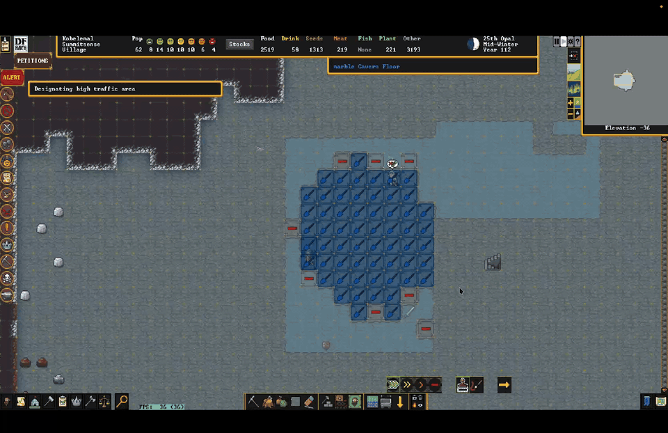
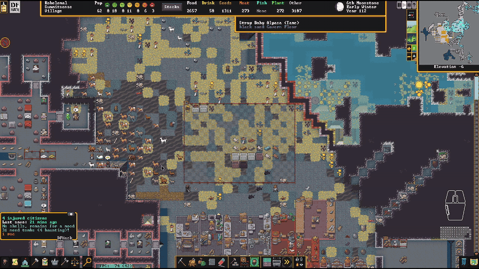
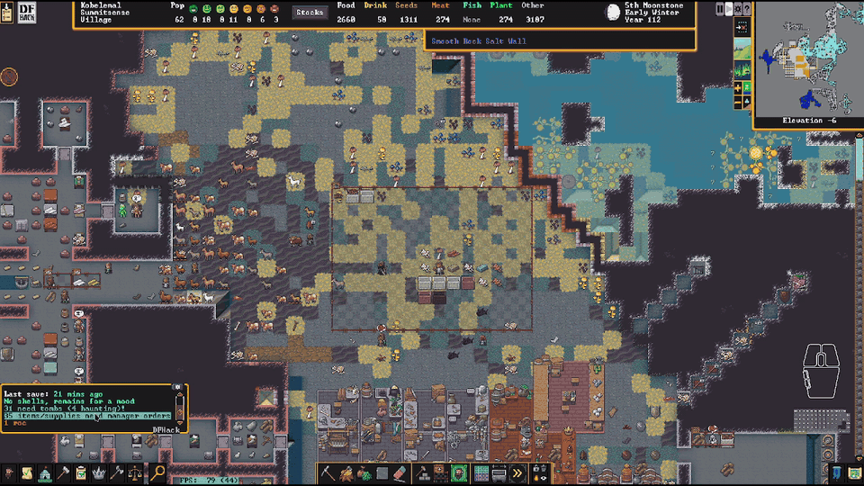
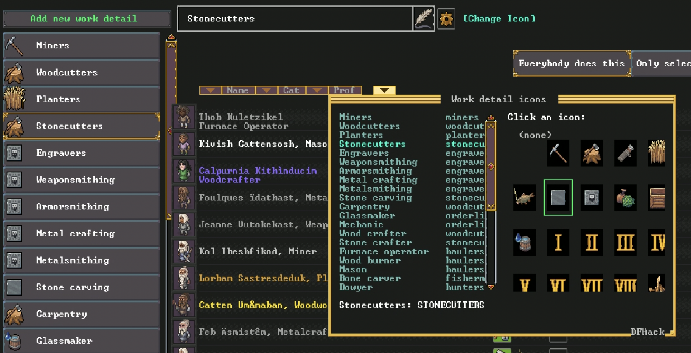

# Fortress mode

## Mining, Building, and Zones

### **`fort/channel-safely`**
Channel a big hole without caving your fort in. Every channel designation is suspended the
instant it appears, then fed back to the miners a few tiles at a time in an order the tool can
prove is safe: at most eight tiles out of the blueprint at once, never two of them touching, and
each one picked with the previous ones imagined as already channelled out. A tile is only let
out if digging it leaves nothing without support — support runs along the four sides and up from
the rock below, never through a corner — and if every other designated tile still has somewhere
to stand that connects out of the excavation. Tiles that are out get restricted traffic so
nobody wanders onto them, and their old traffic setting is restored afterwards. A shape with no
safe order, like a ring drawn around floor that is not itself designated, simply stays planned.
Only tiles a miner can actually get to are let out — revealed, and with somewhere to stand at
their own level — which keeps a designation drawn across undug rock from filling the working set
with tiles nobody can reach; when none of it can be reached yet, `status` says so rather than
blaming the shape. Priority 1 designations are never touched, and
`fort/channel-safely why <x> <y> <z>` explains any tile's verdict. Enabled by `magnus-scripts`.

### **`fort/builder-burrow`**
Turn a burrow into a district. Pick a burrow (only those on a single z-level are listed, under
the name DF shows them by; the burrow is deleted once its blueprints start), a preset (hovels, 2x2 or 3x3 housing, luxury
housing, varied housing, noble quarters, tombs, temples, guildhalls) and when to build, and the
burrow is planned on the level you are looking at: roads grow from wherever the burrow touches
your dug floor, one segment at a time, each segment dressed with statue rows and plazas and lined
with districts as it is laid; a road with nothing along it is refused; a second pass fills the
leftover frontage; noble suites and guild complexes are placed as suites with one door on the
road. Then every room, road and hallway piece is started as a `fort/quickfort` job, so digging,
digging,
smoothing, engraving and furniture sequence themselves per tile, and the three blueprints that
want a given square wait for each other on it — a mine designation and a smooth designation never
share a tile, because DF works the smoothing, the mining never happens, and the wall just stays. Every wall around the plan is smoothed, and a room's walls are engraved as well — hallway
walls are left plain, so the carvings belong to the rooms. A noble suite goes further: the floor
under every piece of its furniture is engraved too, carved before the furniture arrives, since
nothing can be carved under a bed. Each stamp declares the activity zone its
room carries (`zone = 'b'`/`'o'`/`'h'`/`'T'` in the preset), and the blueprint gets a `#zone`
section next to its dig, smooth, engrave and build sections — bedrooms, offices, dining rooms and
single-coffin tombs. A catacomb or family tomb declares none and is left to `fort/auto-tomb`,
which zones each coffin separately; auto-tomb stands off any tile a running plan is about to zone,
so the two never race. New stamps added in the preset editor start with the zone their furniture
implies. The burrow's outer ring is never
dug and nothing outside it is touched. Confirming closes the picker immediately and plans in
the background, a slice of a frame at a time, so the game keeps running while the rooms appear;
progress goes to the console and the summary is announced in game. Only "apply now" exists so far. "New preset" and "Edit
preset" open a three-column editor: actions and the settings of the selection, the passes with
their districts and blueprints, and the blueprint library filtered by what is being edited; Enter
on a library entry adds it. Presets save to `dfhack-config/scripts/data/builder-burrow/presets.json`
and copy and paste as JSON through the system clipboard, the same JSON the browser prototype in
`prototypes/burrow-stamper` produces. `fort/builder-burrow status` lists the plans made for this
fort.

### **`fort/dig-shapes`**
Right-click to dig; drag shapes that automatically become staircases, constructions, mining,
chopping or removal.

### **`fort/dig-building`**
A searchable building picker while digging that drops you straight into DF's placement flow.

### **`fort/right-click-cancel`**
Drag to designate, right-drag to erase, right-click to cancel — for every designation and
build tool.

### **`fort/plan-tile`**
Drag to place a whole grid of a building at once while planning, tiled by its footprint so
copies sit edge-to-edge.

A building DF places over a hole rather than on a floor — a well, which goes on open space or a ramp top — is placed by the same drag: the tile the mouse goes down on is one DF has already accepted, so its shape is what the rest of the grid is measured against.

### **`fort/stockpile-place`**
Drag to create a stockpile, expand a selected one, or erase tiles from any pile.

### **`fort/binnable-stockpile`**
Stockpiles can be toggled on/off with one click, set to all meltables, binnables, food, or
drink, and easily set allowed quality. The meltables pile only accepts the metals your civ
works, so adamantine, divine metals and mod metals never reach the smelter.

### **`fort/stable-stockpile-bins`**
Keeps the max bins/barrels/wheelbarrows you set on a stockpile from silently resetting the
next time anything touches its filter. Caps DF can no longer honour — the container stopped
applying, or your number no longer fits on the pile's tiles — go back to being DF's, as does
a pile you give no type (the "None" icon, or clearing it out in Custom settings).

### **`fort/auto-tomb`**
Drops the right zone onto furniture: a tomb on every coffin, a pasture on every nest box.

## Fortress Management

### **`fort/planeswalkers`**
Carry a whole fort between worlds. `fort/planeswalkers save` snapshots the current fort —
terrain (with veins, sand/soil, the grass cover — surface grasses and the
cavern mosses, fungi and lichens alike — and, on a same-size embark, the whole column down
through the magma sea and hell, re-registered on the destination's magma layer with the
layer's z band widened to the arriving sea and any magma pipe above it, so DF keeps rather
than drains it; the destination keeps its own demons), adamantine spires
carried as real spires with their contents — the demon wave waiting in each hollow, the
divine treasures, the encased horrors and magma/water pockets, each with its trigger tiles
and whether it already went off — while the destination's own spire contents under the fort
are removed before the terrain lands, so the load itself can never set them off —
constructions, buildings, stockpiles with their
settings, zones, items (with containment, quality, decorations, and maker), artifacts (named,
with their descriptions and full artifact status — value, quality and the Objects screen —
even on pedestals, with their engraved images redrawn from what they depict), room and
office assignments and the guildhalls/temples/libraries/taverns behind meeting areas,
squads (members, uniforms, ammunition, barracks) and their commander and captains, work details
and labour assignments, burrows, trees and shrubs (shrubs and saplings re-planted where they stood; every tree rebuilt with
its own trunk, branch and root layout and the exact tiles it stood on), the
manager's work-order queue, locked doors and hatches, retired adventurers
(unretirable on arrival), and every unit with skills, personality, appearance, family ties,
kill tallies by species, clothing ownership, and the surrounding historical-figure web — into
`dfhack-config/scripts/data/planeswalkers/<name>/`. On a fresh embark in ANY other world
(same or larger embark size), `fort/planeswalkers load <name>` wipes the footprint
(including the embark's own buildings — the wagon is dismantled, its supplies dropped)
and rebuilds the fort there, dwarves and all. Everything is stored as raw tokens, so worlds
with the same mod set restore near-losslessly; content the destination world lacks (modded
materials, procedurally generated races and their materials, a deity's divine gear, necromantic
secrets) is substituted with the closest equivalent or skipped with a report. Carried spires are laid
down as plain raw-adamantine veins, which survive retire and reclaim; their contents are carried
as DF's own hidden-fun-stuff records. Make a manual DF save before loading — there is no
rollback. An in-game announcement tells you when the save is written and when the fort has
been restored. Run it with no arguments for a walkthrough, or `help fort/planeswalkers` for
the full description. A fort restored into a larger embark than it came from is saved again
at its original size and area, so it keeps travelling to embarks of its own size. `list`,
`delete <name> --yes` (deletes only the snapshot folder), `spires` (re-arm the carried spires
on a fort restored before that pass existed), `repair` (re-registers and refills a magma
sea that drained after the restore — the one recovery still worth a command), `status`, and
`cancel` round out the set.

### **`fort/forge-bars`**
The forge's "Add new task" list names every metal it could work as "iron (opens menu)",
whether you own a bar of it or not. This overlay paints the count over that tail on every row —
"iron (40 bars)", "steel (no bars)", "bronze (319 bars, 2 in use)" — read from the bars on the map
(forbidden bars are not counted; bars a job has already claimed are counted and noted), and the metals
you have none of are moved to the bottom of the list, in DF's order. Metalsmith's
forge and magma forge only. Auto-discovered by `overlay rescan`; `forge-bars` on the console prints
the same counts for the open menu.

### **`fort/workshop-tools`**
Puts a `+` on every queued workshop task that queues another one just like it, and sorts
a shop's "Add new task" list so the jobs you can actually do come before the ones you can't.

### **`fort/quick-order`**
Type plain text on the Work Orders screen to create a legal manager order, with "keep N in
stock" repeats. Only offers subtypes your civilization actually knows how to make.

### **`fort/planner-orders`**
Warns of planned buildings nothing produces and offers the orders to make them. With a hospital
up it also stocks the supplies one needs, traction benches included — the bench and its table,
mechanism and chain each get their own ask. Some asks are standing preferences rather than
one-off gaps: say yes to cutting the rough-gem surplus once and it is handled from then on, one
Cut Gem job at a time, posted again whenever that one is finished and the pile is still over ten
— no second ask, and `planner-orders disable` hands it back. Adamantine is the same, and has to
be: its ladder — keep 3 raw boulders always, then 3 wafers, 3 thread, 3 cloth, 9 wafers for a
true throne, and the rest stays raw — counts the adamantine you have set *aside*, and a manager
order gated on a condition cannot see a forbidden wafer, so it would extract more to replace
what was merely reserved. One rung at a time, and only what that rung asks for.

### **`fort/labor-groups`**
Tidies the Labor screen and creates any missing crafting work details.

### **`fort/sort-locations`**
When you assign a new temple or guildhall, the deities and professions that have actually
*petitioned* for one are moved to the top of the list, in DF's order otherwise — instead of
sitting somewhere among sixty-odd entries that look exactly the same. Petitions are read from
the agreements themselves and filtered to your own site, so another settlement's guild never
pulls a profession up your list. *(No particular deity)* keeps its place at the head, and a
list already in the right order is left alone so nothing shifts while you read it.

### **`fort/choose-labor-icon`**
Pick a work detail's icon from a grid of the actual icons instead of cycling DF's little
selector one at a time.

### **`fort/auto-name`**
Names each migrant wave to share a starting letter (wave 1→A, 2→B, …), gender-correct. A name
it hands out is never one already in use by anybody in the fort — if the pool ever runs dry it
numbers them instead (Aulus II, Aulus III, …).

## Military & Squads

### **`fort/dwarf-rts`**
Command squads like an RTS: pick with number keys, click to move or attack, drag a box to
order a group.

### **`fort/military-labor`**
Keeps the "Military" work detail matched to your standing squads.

### **`fort/training-barracks`**
Marks one barracks as the fort's training barracks and assigns every squad to train there.

### **`fort/squad-buttons`**
A Squads-screen button that selects or deselects all squads.

## Animals

### **`fort/auto-pasture`**
Auto-pens new tame animals, warns when a pasture is overcrowded, and adds graze/butcher
buttons to caged animals.

### **`fort/autobutcher`**
Replaces the stock `autobutcher` plugin and its GUI. One number per species -- how many
ADULTS you want -- instead of four (female kids, male kids, female adults, male adults),
and nothing is butchered until the herd grows past it: then males first, down to a floor
of four, then females. Click the number to type one, the arrows to nudge it, `[edit]` for
the per-species rules the plugin hardcodes -- keep the N oldest (so a herd can age while
every new adult goes to the butcher), infertile first, oldest or youngest first, war
animals last, a juvenile limit, a custom adult age. War-trained, chained and zoo-caged
animals are excluded from the reckoning entirely by default. Small numbers behave
differently on purpose: 2-4 keeps one male and the rest females and never butchers the
last breeding pair, 1 turns the left buttons into `[m] [f]` for which sex survives, and 0
turns them into a `[kids:cull|grow]` toggle. Marks it made it takes back off if you raise
a limit; marks you made by hand it never touches.

### **`fort/help-mood`**
Run by hand during a strange mood (`fort/help-mood`). If the fort cannot satisfy the mood it
says one thing and no more -- *"The gods are testing you"* -- because knowing what a mood wants
IS the blessing, and because by then the demand is already rolled: what you were short of is
`fort/moody-items-warning`'s question, and it answers it all the time. Otherwise it lists
one row per ITEM the mood needs, read from the job's own
filters, proposes the highest-value candidate for each, and lets you click any row to choose
from everything that fits. Where the dwarf's preferences and moodable skill settle it, it says
what is coming: *"...announces they will create a table!"* Then `[build selected artifact]`
forbids every other candidate in the fort -- including ones mined, butchered or woven while the
dwarf walks -- so DF has one legal choice per row and takes it, instead of the nearest boulder.
A requirement's MATERIAL can be changed as well as its item: the mood rolls "adamantine bar"
from whatever the fort held when it struck, and that is a filter DF re-reads every time it
looks, so the picker offers every other material that item type comes in — each marked
*changes the requirement to slade* — and choosing one rewrites the mood. Never a default, and
only against stock you actually have. Requirements already hauled in are shown as claimed and
cannot be changed; candidates are
limited to what the dwarf can actually walk to; worn, part-used and forbidden items are shown,
labelled, and never chosen by default. And when the fort is short of what the mood wants,
`[delay work]` (Ctrl-D) buys the time to make it: the dwarf gets a burrow of nothing but their
own workshop, so there is no item they can reach and the mood holds where it is until you lift
it. Everything it touches is put back.

The mood line names the craft the mood claimed — "Gautier, Clothier, is taken by a fey mood!" —
since that is what decides the base material and whether the fort can supply it at all; DF fixes it on
`unit.job.mood_skill` when the mood begins, so it is known before a workshop is claimed.

The status line quotes the dwarf the way DF does — a fey or fell dwarf *screams, "I must have rock
blocks!"*, a secretive one *sketches pictures of* it, a possessed one *mutters, "It needs …"*, a macabre
one *broods, "Yes. I need …"*.

Items the dwarf cannot walk to are listed last and marked `UNREACHABLE`, and the picker refuses to take
one — hiding them made the panel claim the fort had nothing when it held twenty-five blocks across a
chasm. Where an item was made is ignored: a foreign block builds like any other.

### **`fort/butcher-shop`**
Bulk-marks animals for slaughter, grouped by species and sex, with last-breeder warnings. Young
get their own rows and stay hidden until you ask for them (Ctrl-Y).

### **`fort/filter-other-units`**
Category filter buttons on the Units screen's **Other** tab, where the Dead/Missing tab
keeps its `[Show death cause]`: `[Friendly] [Wildlife] [Hostile]` are independent toggles
(none lit = unfiltered, so clicking one filters to just that and clicking a second adds
it), and `[Caged?]` cycles separately through *cages don't matter* → `[No Cage]` →
`[Caged!]`, so Hostile + `[Caged!]` is your prisoner list. The categories are DF's own,
read out of the `Cat` column it already draws rather than guessed again from unit flags.

### **`fort/animal-training`**
Assigns a trainer to many caged animals at once.

### **`fort/wild-animal-train`**
Marks a wild animal for taming, so it's trained the moment it's caught.

## Automation

### **`fort/idle-smiths`**
Lets idle dwarves work the forge to satisfy their craft need, picking legal metals per item.
Soldiers whose squad is under orders are left to those orders.

### **`fort/auto-mandate`**
Fills Make mandates with cheap materials (even minting coins) and prioritizes the work.
Each order it queues is announced — who mandated it, and what was ordered.

### **`fort/auto-elf-chop`**
Keeps tree-cutting under the elves' yearly limit by designating the nearest trees itself.

### **`fort/harvest-plants`**
Designates every ripe shrub standing in a Gather Fruit zone for gathering once a month, instead
of waiting for the zone to trickle a few tiles out at a time — vegetables and fruitless plants
included, not just what DF picks on its own. It uses DF's own mechanism: the same tile
designation the Designate › Gather tool paints, so DF posts and runs the jobs exactly as if you
had dragged the tool over the zone. Tiles already designated or with a gathering job are skipped,
so nothing is ever doubled up, and withered shrubs (`ShrubDead`, or a plant flagged dead) are never
touched. A `[Harvest]` button on the zone panel, below the three gather settings, turns a zone's
auto-designating off and on and acts immediately: on designates that zone's ripe shrubs there and
then, off clears the designations it painted (jobs DF already posted are left to run — pulling a
job DF owns has crashed this fort). It is on by default, and a zone with "Pick shrubs" switched off
is skipped. Only shrubs with something on them are designated — a plant with growths has produce
only while one is in *season*, and leaves and flowers are not produce — and its own designations
are re-checked daily and cleared when their season ends, so a summer berry patch is not still
designated in late autumn on bare twigs. Hand-painted designations are never cleared.

### **`fort/adamantine-hospital`**
Stops the hospital spending adamantine on bruises. DF gives a hospital no material filter, so
dressings and sutures happily consume adamantine cloth and strands. This watches the job list
and, the moment a treatment job has claimed adamantine cloth or thread, forbids that item and
cancels the job — the hospital re-issues the treatment and reaches for ordinary cloth, and
nothing is consumed. `adamantine-hospital release` hands the thread back to your smelter.

### **`fort/loyal-retirees`**
Brings a retired fortress's citizens home when you reclaim it. The roster is kept current as
dwarves join and leave, so whatever the fort looked like when you retired is what gets
summoned back — everyone still alive, however far they wandered.

DF only turns an off-map historical figure back into a real unit when an army carrying them
arrives, and armies can't be fabricated. So this fakes a diplomatic mission for one of your
nobles, lets DF mint the army for it, and puts the returnees aboard: they come back as their
original selves, with their skills, wounds, clothing and inventory intact. Progress is
reported in DF's own announcement log.

`loyal-retirees migrate <hf_id>...` uses the same machinery to summon anyone alive in the
world by historical figure id, whether or not they ever lived here.

### **`fort/broker-ready`**
Frees a soldier broker to trade, then puts their squad back on duty afterward.

### **`fort/rusty-legends`**
Keeps skill rust off a retired adventurer's every skill — matched on the nemesis
`ADVENTURER` flag, never a name or a skill count — and off any citizen's legendary
skills. Everything else rusts as normal. Swept once a game season. There is no stock
DFHack tool for this.

## Information

### **`fort/unit-attributes`**
An `[Attributes]` button on a unit sheet's *Other Skills* tab, above the Progress Bar toggles,
opening all nineteen attributes at once: current value, the highest that dwarf can ever reach,
and how far the value sits from the median for that creature's own caste in DF's steps of 250.
The window measures itself against what it is showing, so nothing is cut off at either edge,
and it does not pause the fort. Click any attribute for the list of jobs and skills that
exercise it — transcribed from the DF wiki, since the game does not expose that mapping at all,
and the panel says so.

### **`fort/creature-description`**
Shows a creature's full description (great for forgotten beasts) with a categorized kill
list — each megabeast type by name, the cursed called out ahead of everything sentient
("1 goblin vampire, 2 kobold necromancers, 1 weremoose"), and sentient kills split by caste
("27 orcs, 9 orc champions, 5 illithids, 2 ulitharids"), with male/female castes grouped
together.

### **`fort/item-description`**
Shows an item's full description instead of DF's truncated box.

### **`fort/statue-redirect`**
Opens a statue's full item description, and adds a Remove button to built items.

### **`fort/clickable-noble-names`**
Makes the dead space on the Nobles screen live: click a noble's row to open their sheet
and follow them, or click one of the office/bedroom/dining/tomb icons to jump to that
room. DF's own assign and symbol buttons still work — the row is measured from the
render, so those blocks are handed straight back to DF.

### **`fort/clickable-squad-members`**
On a squad's details screen, clicking anywhere on a member's row — portrait or name — opens
that dwarf's sheet and follows them instead of offering to replace them. Clicking again,
while their sheet is the one on screen, falls through to DF's position-assignment list: see
who this is, then replace them. Empty positions and the row's own checkbox are untouched.

## Searchable Lists

### **`fort/noble-symbol-search`**
Adds search to the noble symbol-assignment list of tens of thousands of items.

### **`fort/squad-equipment-search`**
Adds a search box to the squad-equipment item picker.

### **`fort/announcement-search`**
Adds search to the huge Announcements settings list.

## Notifications

### **`fort/agitated-animals-notification`**
Names the agitated animals by species instead of a bare count; shift-click attacks them all.

### **`fort/enemies-inside-notification`**
Warns of enemies inside the alert burrow; shift-click sends selected squads to attack.

### **`fort/trader-notification`**
Counts down how many days the trader is ready; click to jump to the depot.

### **`fort/help-mood` notices**
Replaces DFHack's *"moody dwarf is claiming a workshop / can't find needed item"* with the
game's own words: **"Thåkut withdraws from society..."**, *"...works furiously!"*,
*"...keeps muttering..."* — the right line for the mood type, and the dwarf's first name
rather than "moody dwarf". While they are fetching it keeps the mood's own line and counts what has arrived —
*"Thåkut withdraws from society... Claimed 3 items."* When they are stuck it names what they
are short of the way DF would, and a secretive dwarf *sketches* it rather than demanding it; past a week it counts the
days: *"Thåkut has sketched rock blocks for 7 days"*. Clicking follows them with the camera,
clicking again opens the planner. Turning it off in `magnus-scripts`
puts DFHack's own line back rather than leaving a gap.

### **`fort/mood-watch`**
The mood you have *not* had yet. *"A strange mood could strike"* — from DF's own
`mood_cooldown`, population and excavated-tile counters rather than a guess about three
months. Clicking opens a dialog in the fort's own voice — *"Our fortress has grown to attract the
attention of the gods..."* — with three answers: **Reserve a metal**, **Not this time** (back
for the next mood) and **Don't ever show this again**. Reserving one metal means — forbidding every other metal
bar in the fort, and *continuing* to forbid them, so bars smelted or traded for afterwards are
caught too (*"Ensuring slade is used for next mood"*). Only the bars it forbade are ever
released again, so your own forbids are safe. `magnus-scripts` turns the notice back on, and `fort/mood-watch gui` reopens the dialog once the
notice has been clicked away.

A reserve is for the mood you have *not* had: once one actually begins its materials are already
rolled, so the reserve is lifted automatically and every bar it forbade is put back — a clothier's
mood can never use a bar, and the notice stops claiming to steer it.

### **`fort/moody-items-warning`**
Warns when the fort has none of a material a strange mood might demand — stone, logs, leather,
plant/silk/yarn cloth, metal bars, rough or cut gems, blocks, bones, shells, and raw glass in
any type you have produced. A mood asks the moment it starts, so a gap found afterwards is a
berserk dwarf. With stressed dwarves in the fort it also checks remains and bones, which a
macabre mood wants. The list is taken from DFHack's `strangemood` plugin and cross-checked
against the wiki, not from memory. Forbidden stock counts — a forbidden shell is one you have. It
warns at **fewer than three** rather than at none, since three is the most of one thing a mood
asks for and one bar of the metal it settles on is the same dead end as none, found a day
later: *"No shells; only 2 tanned leather for a mood"*.

The shells line only appears when somebody in the fort actually prefers a shell material: shells are
the one mood material chosen by preference rather than stock (a bone carver demands shells only if they
like a type of shell, bones otherwise), so a fort with no shell-lover can never be asked for one.

### **`fort/empty-labor-notification`**
Warns when a restricted work detail has nobody who can actually do it. Stays quiet while
`autolabor` or `labormanager` is enabled, since those assign labors themselves.

### **`fort/needs-tomb-notification`**
Alerts when a dwarf dies with no tomb, or when anything is haunting the fort — a ghost counts
whether or not it was ever a citizen. Click for a death browser with cause, kills and a
clickable family tree, and queue memorial slabs in bulk.

### **`fort/civ-alert-notification`**
During a civilian alert, warns who's still outside the safe burrow; click to find them.

### **`fort/raid-notification`**
Tracks squads out raiding with a rough ETA, and unsticks them weekly.

## Embark

### **`fort/embark-prep`**
Prepare-carefully buttons that give a dwarf the office skills, plus a preferences view.

### **`embark/fast-dwarves`**
Opens a new fortress for you: skips the tutorial prompt, commits a dwarven origin civ, centres
the map on a scored spot near its halls, and clicks Embark. You place the fortress.

### **`embark/extra-info`**
Panel under DF's own, on the final placement step only: the adamantine spire count (or
`NO ADAMANTIUM` when there is none), salt or fresh water, the seven commonest stones (flux, coal and plaster called out) plus a count of
the rest, commonest wood, the wildlife, and **every** civ that can reach you — not vanilla's four.

### **`embark/assistant`**
Site finder, replacing the retired `embark-assistant` plugin. Bare `embark/assistant` opens a
window: type filters, press Enter, press Enter on a result to jump the map there. Filters cover
flux, coal, plaster, named metals and minerals, sand, clay, soil, rivers, aquifers, volcanoes,
biome, tree density, freezing, evil weather, savagery, evil, and neighbouring civs and towers by
name or count. `s` runs an ~11 s survey that adds **magma pools by cavern level**, which is not
world-wide data. Also works from the console — `embark/assistant help`.

## One-time-commands

### **`fort/civilian-militia`**
Packs office-holder civilian squads into ready and reserve squads on command.

### **`fort/cheatmine`**
Instantly finishes all designated digging and any planned staircases (cheat).

### **`fort/force-more`**
Forces attack events the stock `force` can't, like real forgotten-beast cavern attacks.

### **`fort/destroy-forbidden`**
Destroys loose forbidden items lying on the ground.

### **`fort/clear-flows`**
Clears miasma and other flow clouds — a quick FPS fix.

### **`fix/raiders`**
Rescues squads and soldiers stuck on off-site raids.

### **`fort/raid-status`**
Reports raiding parties and a rough travel estimate, and retrieves stuck units.

### **`fort/caravan-teleport`**
Teleports a stranded merchant caravan back onto the depot.

### **`fort/worldgen-setup`**
Sets up a fresh test world: selects every installed mod and maxes the civilization/site
sliders from data, so only the Create-world click is left to you.

## Miscellaneous

### **`fort/gen-world`**
Drives world creation from the title screen, writing the mod list and all five sliders as
data and clicking only the buttons that have no data equivalent.

### **`fort/ha-census`**
Reports a freshly generated world's population at years 1/25/50/75/100, civ counts, sites and
castles, and the terrain each civ settled. Run it straight after generation, before saving.

### **`fix/old-saves`**
Marks old-game-version saves on the title screen's Continue Game lists — DF itself only tells
you after you load. Every save last written by an *older* game version than the one running
gets its "Files" button repainted: a red **CRASH** when loading would cross a known
backwards-incompatible build (3600, 3602 — hover the stamp for the workaround: procedurally
generated syndromes may crash, exterminate/full-heal the carriers), or a yellow **!OLD!**
when it's merely older and expected to load fine. The version is read from each save's
`world.sav` header (DF's title-screen data doesn't carry it), and rows are identified by the
save's folder name so same-named copies of a world can't be confused. Run the command bare at
the title screen to print every save and its version.

