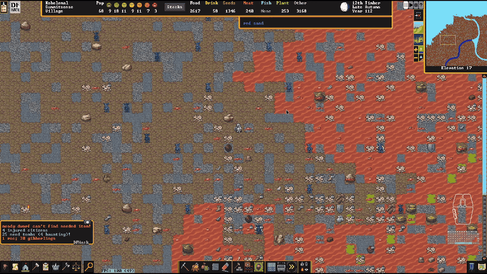

# Joke mode

Tools that exist for the bit. They work, they are not broken, and they are not in the README:
`make readme` composes that from the fortress, adventure and High Adventure feature files
only, and this one is deliberately left out — same as `BROKEN_FEATURES.md`, for the opposite
reason.

They live in `dfhack/joke/` and deploy like any other category, so the command keeps its
prefix: `joke/super-saiyan`, `joke/noble-crowns`.

## Off unless you ask

`fort/magnus-scripts` shows a `joke/` column, and it is the one column that behaves
differently in both directions:

- **Off by default.** Every other row in that GUI is on unless you have turned it off — a
  fresh install arms the whole pack. Joke rows invert that: they stay off until you turn one
  on. In the config they are stored under `enabled` rather than `disabled`, so absent means
  off.
- **No master switch reaches them.** `[r]` (recommended: everything on/off) and `[m]` (all
  new mods) both skip the column entirely. Only the `joke/` header `[j]`, or clicking one of
  its rows, will arm one.

A joke should never arrive by surprise, and "arm the useful pack" should not start playing
anime music at somebody.

## Tools

### **`joke/super-saiyan`**
The instant a citizen enters a martial trance, the game pauses, **the camera follows them**,
and the Ultra Instinct theme plays in full — a trance is a fight, and centring once would only
show you where it started. The camera is pointed and then left alone; you will move it
yourself soon enough. A martial trance is the best thing a dwarf can do and DF announces it in
a line of grey text you will miss.

    enable joke/super-saiyan     watch for martial trances
    disable joke/super-saiyan    stop watching
    super-saiyan                 status
    super-saiyan test            do the whole thing on a citizen now, trance or not
    super-saiyan stop            cut the theme short

Trances are detected as `unit.counters.soldier_mood == MartialTrance` on the rising edge, per
citizen, so one trance fires once. While the theme is playing a further trance is skipped
whole — sieges produce them in clusters and each one restarting the track would be a stutter,
not a celebration.

The sound needs the **`ssaudio`** plugin (`plugins/ssaudio`; `make install` downloads the
prebuilt linux/windows binary from this repo's `ssaudio-v*` releases, or build it from source
with `make build-ssaudio`),
because DFHack's Lua sandbox has no audio call and no way out to a shell — `os.execute` and
`io.popen` are both nil. It decodes an mp3 with minimp3 and plays it on its own SDL2 audio
device. Without the plugin everything else still happens and the theme is silent; the status
line says which. The track is read from `dfhack-config/scripts/data/`.

Only creatures with the `[TRANCES]` raw token can trance at all — in vanilla that is dwarves
and nothing else.

### **`joke/noble-crowns`**
Forbids any crown a commoner wears, claims or reaches for, so the mayor's regalia stops ending
up on a peasant. Nobles and administrators alike may keep them — anyone holding a position of
any rank, tested with `dfhack.units.getNoblePositions`.

    enable joke/noble-crowns     watch crowns (checks every 100 frames)
    disable joke/noble-crowns    stop watching
    noble-crowns                 status: every crown, who has it, what is forbidden
    noble-crowns release         unforbid every crown in the fort

Hauling is always allowed — forbidding a crown mid-carry drops it where it stands, and the
destination that matters is the trade depot. Only citizens are policed: a merchant's stock and
a visiting lord's hat are not the fort's property. The forbid is a sync rather than a ratchet,
so a crown nobody unqualified is holding is released again.

### **`joke/dwarfify`**
Adds your own tracks to the game's music, played by **DF itself** rather than beside it. The
music slider moves them, muting the game mutes them, and they do not play on top of whatever
DF had already started — because they go through FMOD as ordinary songs. `dwarfort` is
stripped, but its sound code lives in `libg_src_lib.so` and is linked dynamically, so the
`musicsoundst` API is exported; DF also ships `g_src/music_and_sound.cpp`, which shows how the
game adds custom music itself — take an id from `next_song_id++`, `set_song(file, id, loops)`,
then `startbackgroundmusic(id)`. That is the path this uses, so a track added here is the same
kind of thing as a track added by a mod. Your tracks live in one folder — `dfhack-config/music/`, where
`joke/super-saiyan`'s theme is installed too — so `joke/dwarfify play ultra` plays the joke's
music as ordinary music. The game's own 121 songs are pickable by name as well (`play strange
moods`), read from the `enum Song` in the `g_src` header DF ships. Enabling it
starts another of your tracks whenever the game moves on from the last one — DF's scheduler
still owns the playlist, and this does not fight it.
