<!-- GENERATED FILE — do not edit README.md directly.
     Composed by `make readme` from README-HEADER.md, FORTRESS_MODE_FEATURES.md,
     ADVENTURE_MODE_FEATURES.md and HIGH_ADVENTURE_FEATURES.md.
     Edit those instead; anything written here is overwritten on the next build. -->

# dfhack-commands

A personal pack of **DFHack scripts** for the latest Dwarf Fortress (0.53.x / Steam),
plus the **Dwarf Fortress: High Adventure** content-mod suite.

- Scripts live in [`dfhack/`](dfhack/), in folders that mirror the deployed tree —
  `fort/`, `adv/`, `embark/`, `fix/`. The folder is the command prefix: `fort/auto-name`,
  `adv/reveal`. Copy them into `dfhack-config/scripts/` and they become commands.
- Content mods live in [`content-mods/high-adventure/`](content-mods/high-adventure/).
- Things that don't work yet are kept out of this list — see
  [`BROKEN_FEATURES.md`](BROKEN_FEATURES.md).
- **Full command reference, implementation notes and TODOs:**
  [`DEVNOTES.md`](DEVNOTES.md). Repo/workflow quickstart: [`instructions.md`](instructions.md).

## Turning it all on — `magnus-scripts`

`magnus-scripts` is the switch for the whole pack. Run it once per session — or add it to
`dfhack-config/init/dfhack.init` and forget about it — and every always-on helper below is
enabled at once: the notification overlays, the watchdog services, the map and stockpile
tools. Anything destructive or situational is deliberately left out and stays a command you
run by hand.

```sh
magnus-scripts          # enable the always-on helpers for this session
magnus-scripts lovely   # ...plus a batch of stock DFHack tools and a few extras
```

It is safe to re-run at any time: each helper it starts is idempotent, and it disables and
re-enables its own services rather than stacking them.

---

<details>
<summary><h1>Fortress mode</h1></summary>


## Mining, Building, and Zones

### **`fort/dig-shapes`**
Right-click to dig; drag shapes that automatically become staircases, constructions, mining,
chopping or removal.

### **`fort/dig-building`**
A searchable building picker while digging that drops you straight into DF's placement flow.

### **`fort/right-click-cancel`**
Drag to designate, right-drag to erase, right-click to cancel — for every designation and
build tool.

### **`fort/plan-tile`**
Drag to place a whole grid of a building at once while planning, tiled by its footprint so
copies sit edge-to-edge.

### **`fort/stockpile-place`**
Drag to create a stockpile, expand a selected one, or erase tiles from any pile.


### **`fort/binnable-stockpile`**
Stockpiles can be toggled on/off with one click, set to all meltables, binnables, food, or
drink, and easily set allowed quality. The meltables pile only accepts the metals your civ
works, so adamantine, divine metals and mod metals never reach the smelter.

### **`fort/stable-stockpile-bins`**
Keeps the max bins/barrels/wheelbarrows you set on a stockpile from silently resetting the
next time anything touches its filter. Caps DF can no longer honour — the container stopped
applying, or your number no longer fits on the pile's tiles — go back to being DF's, as does
a pile you give no type (the "None" icon, or clearing it out in Custom settings).

### **`fort/auto-tomb`**
Drops the right zone onto furniture: a tomb on every coffin, a pasture on every nest box.

## Fortress Management

### **`fort/workshop-tools`**
Puts a `+` on every queued workshop task that queues another one just like it, and sorts
a shop's "Add new task" list so the jobs you can actually do come before the ones you can't.

### **`fort/quick-order`**
Type plain text on the Work Orders screen to create a legal manager order, with "keep N in
stock" repeats. Only offers subtypes your civilization actually knows how to make.

### **`fort/planner-orders`**
Warns of planned buildings nothing produces and offers the orders to make them. With a hospital
up it also stocks the supplies one needs, traction benches included — the bench and its table,
mechanism and chain each get their own ask.

### **`fort/labor-groups`**
Tidies the Labor screen and creates any missing crafting work details.

### **`fort/auto-name`**
Names each migrant wave to share a starting letter (wave 1→A, 2→B, …), gender-correct.

## Military & Squads

### **`fort/dwarf-rts`**
Command squads like an RTS: pick with number keys, click to move or attack, drag a box to
order a group.

### **`fort/military-labor`**
Keeps the "Military" work detail matched to your standing squads.

### **`fort/civilian-militia`**
Packs office-holder civilian squads into ready and reserve squads on command.

### **`fort/training-barracks`**
Marks one barracks as the fort's training barracks and assigns every squad to train there.

### **`fort/squad-buttons`**
A Squads-screen button that selects or deselects all squads.

## Animals

### **`fort/auto-pasture`**
Auto-pens new tame animals, warns when a pasture is overcrowded, and adds graze/butcher
buttons to caged animals.

### **`fort/butcher-shop`**
Bulk-marks animals for slaughter, grouped by species and sex, with last-breeder warnings. Young
get their own rows and stay hidden until you ask for them (Ctrl-Y).

### **`fort/animal-training`**
Assigns a trainer to many caged animals at once.

### **`fort/wild-animal-train`**
Marks a wild animal for taming, so it's trained the moment it's caught.

## Automation

### **`fort/idle-smiths`**
Lets idle dwarves work the forge to satisfy their craft need, picking legal metals per item.

### **`fort/auto-mandate`**
Fills Make mandates with cheap materials (even minting coins) and prioritizes the work.
Each order it queues is announced — who mandated it, and what was ordered.

### **`fort/auto-elf-chop`**
Keeps tree-cutting under the elves' yearly limit by designating the nearest trees itself.

### **`fort/adamantine-hospital`**
Stops the hospital spending adamantine on bruises. DF gives a hospital no material filter, so
dressings and sutures happily consume adamantine cloth and strands. This watches the job list
and, the moment a treatment job has claimed adamantine cloth or thread, forbids that item and
cancels the job — the hospital re-issues the treatment and reaches for ordinary cloth, and
nothing is consumed. `adamantine-hospital release` hands the thread back to your smelter.

### **`fort/broker-ready`**
Frees a soldier broker to trade, then puts their squad back on duty afterward.

### **`fort/rusty-legends`**
Keeps skill rust off a retired adventurer's every skill — matched on the nemesis
`ADVENTURER` flag, never a name or a skill count — and off any citizen's legendary
skills. Everything else rusts as normal. Swept once a game season. There is no stock
DFHack tool for this.

## Information

### **`fort/creature-description`**
Shows a creature's full description (great for forgotten beasts) with a categorized kill
list — each megabeast type by name, the cursed called out ahead of everything sentient
("1 goblin vampire, 2 kobold necromancers, 1 weremoose"), and sentient kills split by caste
("27 orcs, 9 orc champions, 5 illithids, 2 ulitharids"), with male/female castes grouped
together.


### **`fort/item-description`**
Shows an item's full description instead of DF's truncated box.


### **`fort/statue-redirect`**
Opens a statue's full item description, and adds a Remove button to built items.


## Searchable Lists

### **`fort/noble-symbol-search`**
Adds search to the noble symbol-assignment list of tens of thousands of items.

### **`fort/squad-equipment-search`**
Adds a search box to the squad-equipment item picker.

### **`fort/announcement-search`**
Adds search to the huge Announcements settings list.

## Notifications

### **`fort/agitated-animals-notification`**
Names the agitated animals by species instead of a bare count; shift-click attacks them all.

### **`fort/enemies-inside-notification`**
Warns of enemies inside the alert burrow; shift-click sends selected squads to attack.

### **`fort/trader-notification`**
Counts down how many days the trader is ready; click to jump to the depot.

### **`fort/empty-labor-notification`**
Warns when a restricted work detail has nobody who can actually do it.

### **`fort/needs-tomb-notification`**
Alerts when a dwarf dies with no tomb, or when anything is haunting the fort — a ghost counts
whether or not it was ever a citizen. Click for a death browser with cause, kills and a
clickable family tree, and queue memorial slabs in bulk.

### **`fort/civ-alert-notification`**
During a civilian alert, warns who's still outside the safe burrow; click to find them.

### **`fort/raid-notification`**
Tracks squads out raiding with a rough ETA, and unsticks them weekly.

## Embark

### **`fort/embark-prep`**
Prepare-carefully buttons that give a dwarf the office skills, plus a preferences view.

## One-time-commands

### **`fort/cheatmine`**
Instantly finishes all designated digging and any planned staircases (cheat).

### **`fort/force-more`**
Forces attack events the stock `force` can't, like real forgotten-beast cavern attacks.

### **`fort/destroy-forbidden`**
Destroys loose forbidden items lying on the ground.

### **`fort/clear-flows`**
Clears miasma and other flow clouds — a quick FPS fix.

### **`fix/raiders`**
Rescues squads and soldiers stuck on off-site raids.

### **`fort/raid-status`**
Reports raiding parties and a rough travel estimate, and retrieves stuck units.

### **`fort/caravan-teleport`**
Teleports a stranded merchant caravan back onto the depot.

### **`fort/loyal-retirees`**
Brings a retired fortress's citizens home when you reclaim it. The roster is kept current as
dwarves join and leave, so whatever the fort looked like when you retired is what gets
summoned back — everyone still alive, however far they wandered.

DF only turns an off-map historical figure back into a real unit when an army carrying them
arrives, and armies can't be fabricated. So this fakes a diplomatic mission for one of your
nobles, lets DF mint the army for it, and puts the returnees aboard: they come back as their
original selves, with their skills, wounds, clothing and inventory intact. Progress is
reported in DF's own announcement log.

`loyal-retirees migrate <hf_id>...` uses the same machinery to summon anyone alive in the
world by historical figure id, whether or not they ever lived here.


### **`fort/worldgen-setup`**
Sets up a fresh test world: selects every installed mod and maxes the civilization/site
sliders from data, so only the Create-world click is left to you.

## Miscellaneous

### **`fort/gen-world`**
Drives world creation from the title screen, writing the mod list and all five sliders as
data and clicking only the buttons that have no data equivalent.

### **`fort/ha-census`**
Reports a freshly generated world's population at years 1/25/50/75/100, civ counts, sites and
castles, and the terrain each civ settled. Run it straight after generation, before saving.
</details>

<details>
<summary><h1>Adventure mode</h1></summary>


## Adventure mode features

### **`adv/auto-save`** 
Save adventurer mode automatically. `adv/auto-save enable 20` to save every
  20 minutes, which is default. 1 hour must pass in-game between autosaves.

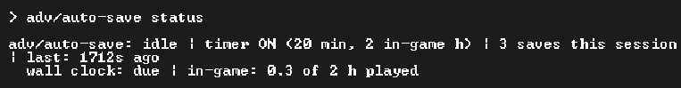

### **`adv/map-travel`** 
Allow clicking to travel more than 1 tile in fast travel, like in
  non-fast-travel.

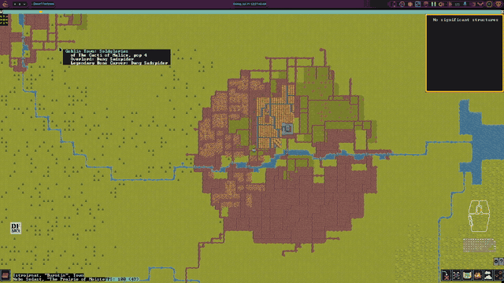

### **`adv/reveal`** 
Adventure mode reveal only when not in combat. You can easily navigate around
  a castle, dark goblin pit, dwarven fortress, or find a lair, and then not get an advantage in
  combat. It automatically re-enables when you leave fast traveling.

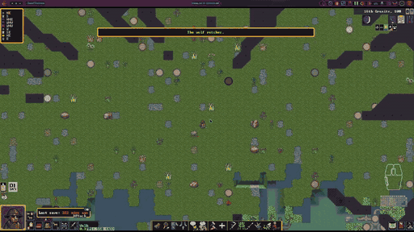

### **`adv/always-be-satiated`** 
Automatically eat and drink (non healing potions) when not in
  combat.

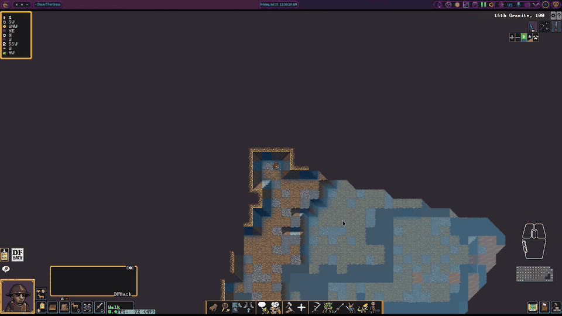

### **`adv/keep-inventory`** 
Automatically reopen the inventory and scroll to the last position
  when you use it.

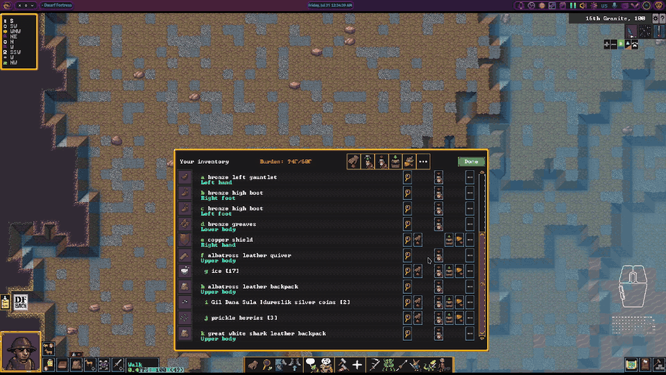

### **`adv/inventory-display-weight`** 
Show every item's weight in the inventory list and the pick-up menu.

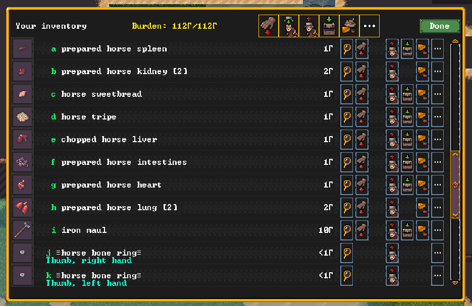

### **`adv/inventory-search`** 
Search the inventory list (Alt-S) by item description, material or type.
  Magic words: `heavy` sorts by weight, `equip`/`equipped` shows equipped items
  (hands always first, then strapped weapons/tools, containers last), `food` shows food and drink (drinks, food,
  healing drinks, healing food, then ethics-refused sapient flesh; containers
  excluded), `healing` shows food/drink with beneficial syndromes. The unsearched list
  displays in the equip order by default. keep-inventory reopens keep the filter.

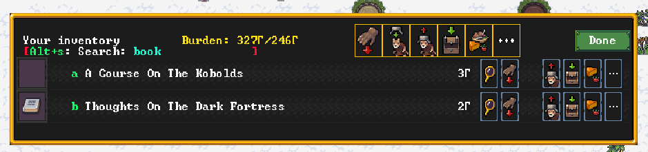
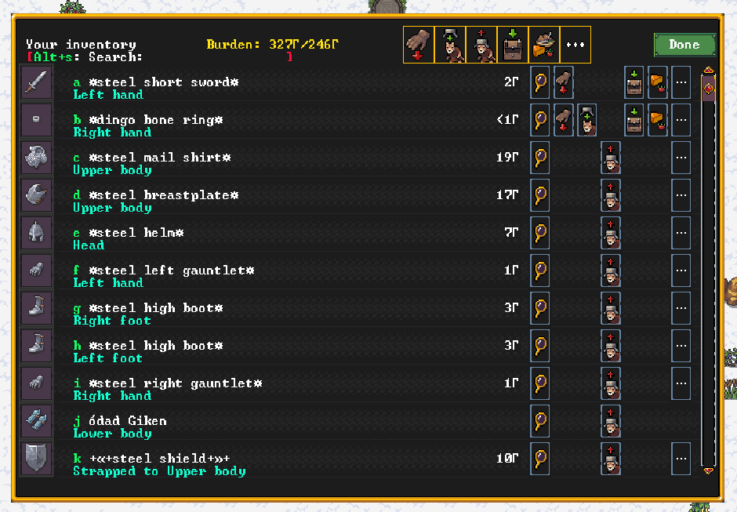

### **`adv/travelling-hunger`** 
Show how many meals, drinks and 8-hour sleeps you need on the fast-travel screen's top row.

### **`adv/heat-ice`** 
Sort "heat ice" / "heat snow" options to the top of interact menus.

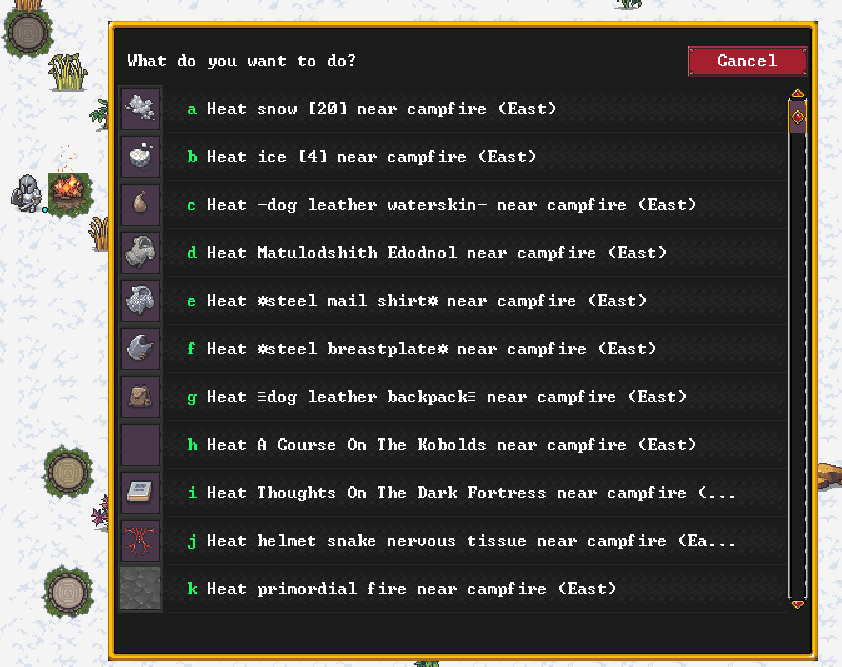

### **`adv/advfort`** 
Do fort jobs as an adventurer: community rework of DFHack's paused `gui/advfort`
  (jobs on CAREFUL move, so walking and the look cursor work; separate Smooth vs
  Detail/engrave jobs) plus local fixes: the "you haven't acted in a while" prompt
  no longer wedges a long wait, and Smooth jobs designate their tile and actually
  smooth it on completion.

### **`adv/keep-talking`** 
Automatically reopen a conversation you are participating in.

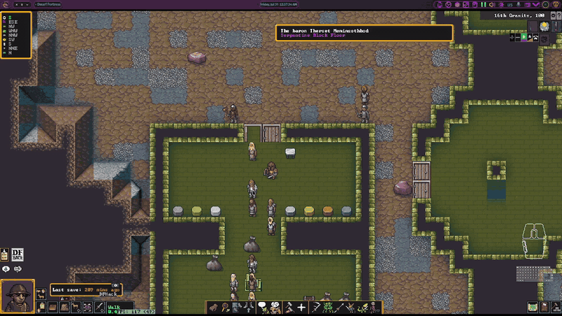

### **`adv/read-the-map`** 
Allow hovering over sites to learn about them in fast travel.

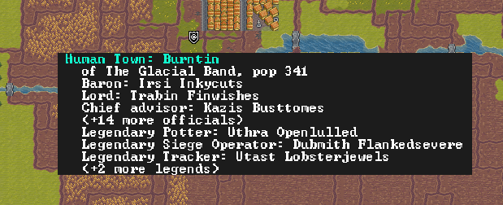

### **`adv/right-click-move`** 
Right clicking (if it gives no other options) automatically
  initiates movement, dismissing when the game annoyingly asks for two confirmations. Saves 3
  mouse clicks / key presses for a basic action.

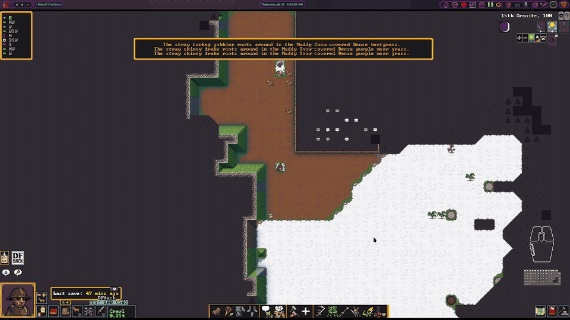

### **`adv/watch-their-blade`** 
The attack screens show a combat summary under each name — every
  candidate on the "Who will you attack?" chooser, and your target on the attack
  screens after you pick: their wounds ("Faint, Heavy Bleeding"), worn armor
  ("iron greaves, iron breastplate") and what they are holding, by hand ("Left
  hand silver carving knife, right hand copper whip") — including sheathed
  weapons. Pick your target, and your fight, with open eyes.

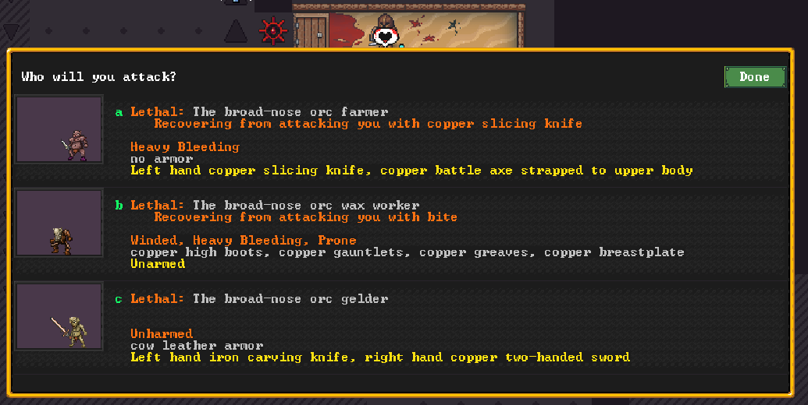

### **`smooth-movement`** 
Smooth camera panning in adventure mode, and smooth movement for
  creatures and the player in adventure mode. (A C++ plugin rather than a script — install it
  with `make install`.)

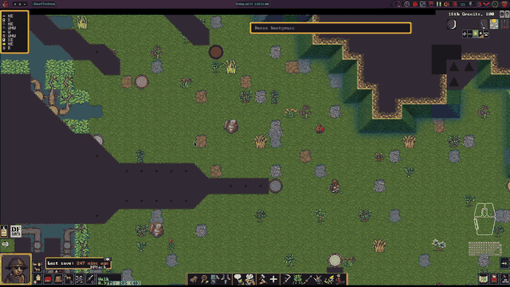

### **`adv/im-sure`** 
Automatically dismiss "you haven't acted in a while" for long-running move
  commands.

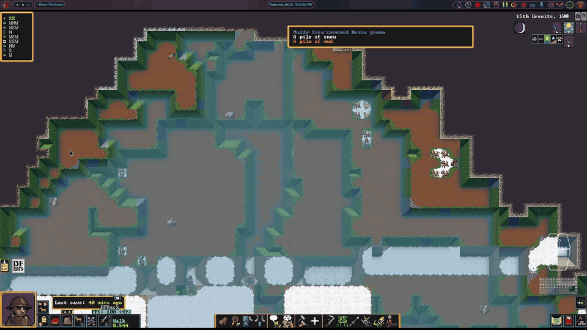

## Adventure mode embark features

### **`embark/adventurer-values`** 
Modify adventurer needs easily when you create your adventurer
  — so you can make a barbarian who loves to fight or avoid the impossible-to-satisfy Intense Need
  For Family (without memorizing which values affect which needs, where they are in the list,
  etc).

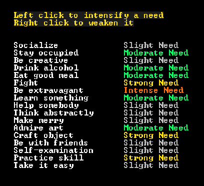

### **`embark/adventurer-default-items`** 
Automatically give you a decent starting gear loadout
  when creating an adventurer, and let you switch metals on your gear more easily.

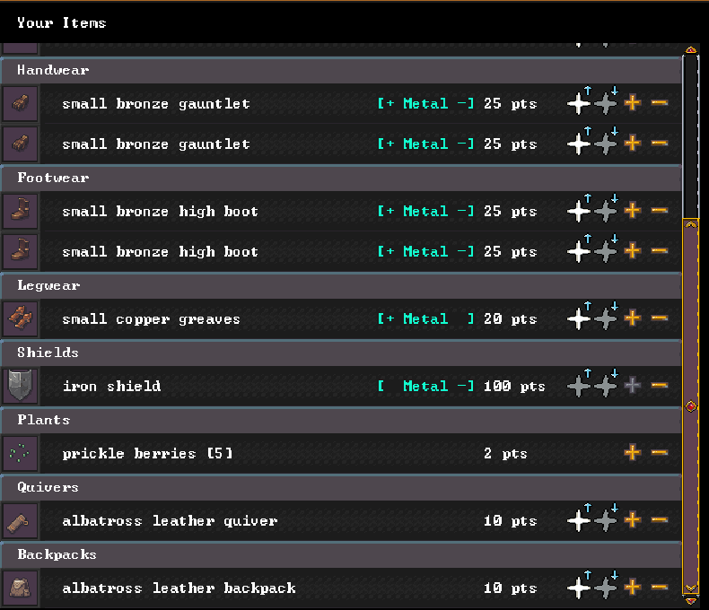

### **`embark/adventurer-map`**
Show information about sites on the world map during adventurer creation. Clicking on a
site changes your origin to there, if possible.

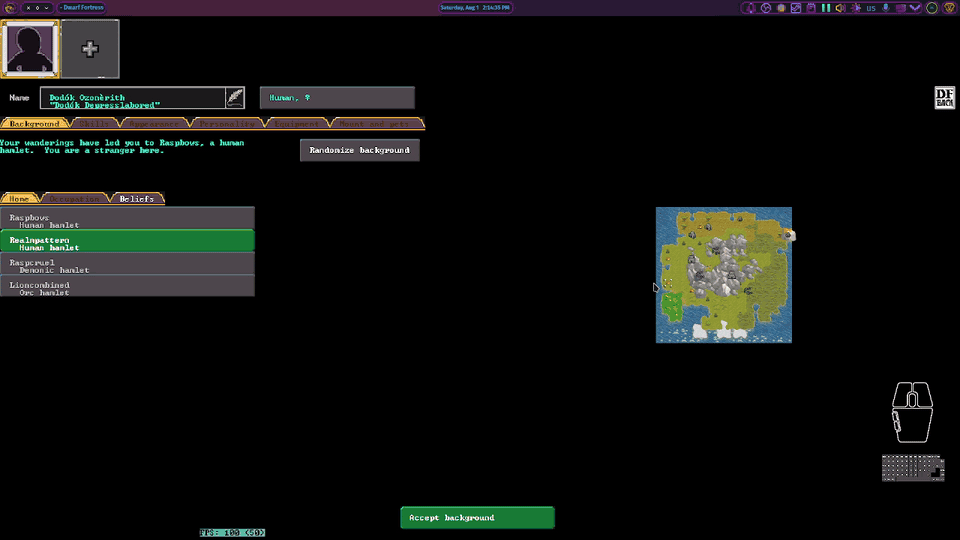
</details>

<details>
<summary><h1>Dwarf Fortress: High Adventure</h1></summary>


A family of new-content mods adding several playable civilizations, designed to work
**together or individually**. Source lives in
[`content-mods/high-adventure/`](content-mods/high-adventure/) — one folder per mod, each with
its own `CHANGES.md`. Design rules and fork provenance are in
[`content-mods/README.md`](content-mods/README.md).

> **Raw changes (`objects/`) only take effect in a newly generated world.** A mod's
> `scripts_modactive/` scripts reload for an existing save, and graphics come from that world's
> baked snapshot. See [`instructions.md`](instructions.md) for deploy steps.

## Playable Civs

The vanilla civilizations made playable. Humans, elves and goblins can be played in fortress
mode, and every one of them — plus kobolds — can be rolled as an adventure-mode outsider. A fork
of *All Races Playable Redo*.

### Fortress mode
Humans become playable by gaining the full slate of fort noble positions they were missing, so
a human fort can appoint a mayor, manager, bookkeeper and the rest exactly as any other does.
Otherwise they play as the game already imagines them.

Elves gain those positions too, and the Shaping Tree besides, because a civilization that
refuses to fell a tree still needs wood. A shaper plants a seed into a living tree and the
workshop grows around its trunk under the open sky; from then on it yields wood on its own,
and a skilled strand extractor coaxes far more out of the same tree than an unskilled one.
Elves also have no picks, which normally means a Remove-Construction order can never finish —
here those orders complete, so an elf fort can tear its own walls down.

Goblins are rebuilt most heavily. They learn bronze-working, so a goblin fort can arm itself
rather than scavenging, and they receive a single caravan each autumn instead of going entirely
unsupplied. Goblins also don't come back as ghosts, being militant and not caring about the
number of their dead.

### Adventure mode
None of this changes how these civilizations generate — they are placed by the vanilla rules.
What changes is who you can be: dwarves, elves, goblins and kobolds all become outsider-playable
alongside humans, so you can roll an adventurer of any of them.

With Adventure Hostility, each of these races takes its own side. Humans and vanilla elves are
the good civilizations: they turn on evil adventurers but can surrender or flee. Dwarves are
militant good, hostile to the same evil adventurers and never breaking. Goblins belong to the
evil bloc and attack any adventurer outside it. Kobolds are hostile to any non-kobold.

### Scripts
The script paces the Shaping Tree: growing wood takes one month per tree, a freshly built tree
starts on a full month's cooldown, and a job finished too early withers with an announcement. A
skilled strand extractor grows more from the same tree — one bonus log per skill level on top of
the native log, up to twenty-one in total. It also enforces that a Shaping Tree is built under
the open sky and wrapped around a living tree trunk.

Two smaller fixes cover engine gaps. The script completes the elves' Remove-Construction orders
itself, reverting each designated tile, and it dispels goblin ghosts.

## High Elves

A good race composed of tall, reclusive elves who cares little for mortals and asks questions of the stars.

### Fortress mode
High elves play like dwarves, but they cannot chop trees. Instead, they can turn trees into Shaping Trees with a seed, growing wood at them. Skilled shapers can extract strands of twinkling starlight to create divine metals stronger than steel.

### Adventure mode
High elves live in forests in cities, but each civilization is reclusive and never expands. They are hostile to any evil adventurers, and provide an end-game challenge for them using divine weapons, clothing, and armor.

### Scripts
The high elf script enforces that the shaping tree workshop is built under open sky directly below a real tree. It also enforces that shaping trees can only be used once per month. It handles producing varying amounts of wood from the shaping tree based on the worker's skill at strand extraction, and offers a 5% chance to create twinkling strands per level of the worker.

With Adventure Hostility, high elves found in adventure mode automatically have all clothing, armor, and weapons changed to twinkling metal or fabric, and are hostile to evil adventurers unless they have a Pacifier skill of 6 or higher and no weapon drawn.

## Drow

A slender and beautiful humanoid, dark of skin and heart.

### Fortress mode
Drow are evil matriarchal elves who forge freely — any metal, up to and including steel — but
never carry a shield. They fight with scimitars and bows, and keep tame giant spiders as well as
goblin slaves as livestock.

### Adventure mode
Drow settle mountains and forests only, in insular fortresses that almost nothing ever reaches.
One in twenty-five drow is born a drider — a drow torso on a giant-spider body, armed with
paralytic venom and webs.

### Scripts
The drow script issues the war kit to goblin slaves who have been trained for war: an obsidian
short sword, and a wooden breastplate and helm.

With Adventure Hostility, drow belong to the evil bloc alongside goblins, dark dwarves and
succubi, and attack any adventurer from outside it. Their gear is upgraded on sight: males roll
80% iron and 20% steel, driders are always steel, and females wear giant cave spider silk
clothing with no armour and no weapon. A sheathed adventurer with a Pacifier skill of 6 or
better is left alone.

## Illithids

A dread psionic with four tentacles, it hungers for mind and memory.

### Fortress mode
Illithids are ageless brain eaters with a unique life cycle. Illithids can devour the brains of living or dead creatures to gain knowledge and rarely evolve new psionic powers as Ulitharid. When a Ulitharid dies, its brain can be preserved, and eventually combined with adamantine strands to ascend into an Elder Brain. Illithid never wear armor, but have psionic powers granting a unique fighting style, and study of scholarly arts improves their psionic abilities. They prefer to absorb their dead back into the colonies memories rather than simply memorialize them. They are also served by expendable human thralls who can wear armor and do not ever rise as ghosts.

### Adventure mode
They build isolated mountain dark fortresses and trade with nobody. Their ten psionic
interactions scale with scholarship, so an illithid adventurer grows in power by studying.

With Adventure Hostility, illithids are loners: they attack every adventurer who is not himself
an illithid, and they never break. They are among the hardest of all to talk down — it takes a
Pacifier skill of 12, sheathed, to walk among them. Their gear is deliberately left alone, since
they are never armoured anyway.

### Scripts
The illithid script runs psionic ascension: each caste starts at a base level — illithid 1,
ulitharid 4, elder brain 6 — and gains a level at scholarly skill 3, 6, 12 and 24, counting the
highest scholarly skill. Levels are granted as permanent syndromes that carry new abilities.

It enforces the no-armour rule, stripping armour out of squad uniforms and taking it off any
illithid already wearing it, while leaving robes, cloaks and caps alone; thralls are exempt as
human stock. It also runs the labor policy — thralls may never extract strands, and ulitharids
and elder brains have labor switched off on ascension — and drives every Neural Bath job,
including the 20% chance that devouring a brain promotes an illithid to ulitharid.

## Orcs

A medium-sized creature, ready to give its life for the horde.

### Fortress mode
Orcs are warlike and only work pure metals -- they do not understand alloys. They are ruled by a strong champion caste, but are mostly composed of expendable peons who do not need to be memorialized. They do not even have to wait on migrants, and can easily produce more cannon fodder at Breeding Pits.

### Adventure mode
Orcs settle savanna and scrubland hamlets and are hostile to everyone.

With Adventure Hostility, orcs are loners like the illithids: everyone who is not an orc is an
enemy, and they never break. They are the easiest of the hostile races to talk down — a sheathed
adventurer with a Pacifier skill of 3 passes unmolested. Their gear is upgraded on sight into
copper, leather and iron by a weighted roll, so a war party is not all wearing tin.

### Scripts
The orc script runs the Breeding Pit. Each "breed orcs from meat" job tries to birth an orcling
on the spot, failing 75% of the time at first and falling linearly to never failing for a
legendary strand extractor; the worker earns 70 strand-extraction experience per attempt.
Orclings arrive as full citizens, are always common orcs rather than champions, and are named
Peon with an orcish surname. Orc ghosts are dispelled automatically.

## Dark Dwarves

A short, sturdy creature fond of drink and villainy.

### Fortress mode
Dark dwarves are carnivorous cannibals with ironclad in-group loyalty — they never tantrum, no
matter what happens to the fort. They trade with succubi, goblins, and drow in winter.

### Adventure mode
They live in deep mountain halls, but are otherwise very similar to vanilla dwarves except for
being hostile to good adventurers instead of evil ones.

### Scripts
With Adventure Hostility, dark dwarves belong to the evil bloc alongside drow, goblins and
succubi, and attack any adventurer from outside it. Their gear is upgraded on sight by the same
weighted roll the vanilla dwarves use — mostly copper, with bronze and iron coming up — so they
are not left in whatever metal worldgen happened to hand them. A sheathed adventurer with a
Pacifier skill of 6 or better is left alone.

## Succubi

A hedonistic female creature which plays with hearts and fire.

### Fortress mode
Succubi are demonic realm-builders who keep the full demonic wardrobe but fight with ordinary
arms. They build downward toward the magma they love: a magma well draws it up where there is
none, letting a young colony run magma industry from the surface. Beyond that they corrupt
creatures to their side, summon servants outright rather than waiting for migrants, and work
bone and glass into the trappings a demon court expects.

### Adventure mode
They are desert city-builders with land-holding Demon princes and outdoor fortifications, and
send caravans to the evil bloc in summer only.

With Adventure Hostility, succubi belong to the evil bloc alongside drow, goblins and dark
dwarves, and attack any adventurer from outside it. A sheathed adventurer with a Pacifier skill
of 6 or better is left alone. Their gear is deliberately left untouched — the demonic wardrobe
is the point, and re-forging it into iron would ruin them.

### Scripts
The succubus script switches on the three submodules its workshops depend on, without which
those reactions silently do nothing: the magma well that conjures magma where the map has none,
the powers that drive their summoning and demonic abilities, and the corruption that turns
other creatures to their side.

## Kobolds

The playable kobold civilization: a fork of *Cute Kobold Caverns* with *Skulking Filth*'s
item-thief hard mode.

### Fortress mode
Kobolds play as thieves. A kobold civilization is sometimes ruled by an Ancient Dragon, and
when it is, the eldest becomes the Dread Wyrm king — a civilization-level monarch rather than a
site one, who rules from wherever it lairs and carries out the civ's executions, a role the
kobolds otherwise have nobody to fill.

### Adventure mode
Ancient Dragons also lair the world as megabeasts in their own right — a huge winged creature
full of dread majesty, soaring on iron-hard scales immune to any fire. They come in one-, two-
and three-headed castes, with spiked or clubbed tails.

With Adventure Hostility, kobolds attack any adventurer who is not a kobold, and their dragon
overlords count as the same faction. A plain kobold gives up easily — a sheathed Pacifier skill
of 1 is enough — but they are emboldened while one of their dragons is on screen, and then it
takes 12, which is also what a dragon overlord always demands. Two ancient dragons meeting is
read as a challenge: every other ancient dragon turns on a dragon adventurer, and so do the
kobolds standing with that rival, even though the civ would otherwise greet a dragon as an
overlord. Kobold gear is left untouched.

### Scripts
The kobold script brings idle dragons down. A flier in Dwarf Fortress has no reason to land, so
a dragon that finishes a flight parks itself a dozen z-levels up — unreachable in adventure
mode, and in fortress mode a permanent "there is a dragon here" that nothing can resolve. Any
airborne ancient dragon, wild megabeast or Dread Wyrm alike, glides down a z-level at a time
until it is standing on the ground. It only does this while nothing is fighting the dragon: one
that is jumped halfway down stops descending and is handed back to the game's own AI, so an air
attack is never turned into a free kill. Magma, deep water, the adventurer, and caged, ridden,
stunned or unconscious dragons are all left alone.

## Second Humans

These exist to balance populations; humans expand across the whole map, while other
civilizations have restrictive placement, and this mod causes them to outnumber other races
rather than be about equal to orcs.

## Beasts

Adds gibberlings: small, gibbering predators with blue chitin, who swarm and devour the living.

## Adventure Hostility

Makes the suite's civilizations behave like enemies in adventure mode, and upgrades the gear
everyone in the world is carrying.

### Fortress mode
The war-gear half runs in fortress mode too, but only ever touches **invaders and visitors** —
never your own citizens, and never migrants joining the fort. So a siege or a caravan arrives in
the metal its civilization is supposed to wear, while your fort equips itself as normal.

### Adventure mode
Each turn, nearby members of a hostile faction are put into a conflict with the adventurer
specifically — never with their own people — by placing them in the same Conflict activity the
game builds when you attack someone. Hostility is site-scoped: inside a settlement only that
settlement's own people turn on you, so a drow merchant visiting a high elf town stays a guest.
Units of the adventurer's own civilization are always left alone whatever their race.

The factions are: orcs and illithids, each hostile to everyone but their own kind; the evil
bloc (drow, dark dwarves, succubi, goblins), hostile to any adventurer outside it; the good
civilizations (humans, vanilla elves), hostile only to evil adventurers and able to surrender or
flee; the militant good (high elves, dwarves), hostile to the same evil adventurers and never
breaking; and kobolds, hostile to any non-kobold.

**Sheathe your weapon and talk.** An adventurer whose Pacifier skill meets a race's threshold
and who has not drawn a weapon is never attacked at all — you do not have to fight anyone first
or hold them at a surrender. Draw steel and the exemption lapses that same turn. The thresholds
are goblin 1, orc 3, drow, succubus, dark dwarf, high elf and dwarf 6, illithid 12, and kobold
1 rising to 12 while a dragon overlord watches. The same number decides whether a surrender
already given is allowed to stand.

### Scripts
Two scripts ship here. `adventure-hostility.lua` is the adventure-mode overlay described above;
it also sets NOFEAR on a faction so it never breaks, and clears a yield each turn for anyone
below the threshold.

`war-gear.lua` is a separate script because it has to run in fortress mode as well. Worldgen
spreads a civilization's equipment across every metal it knows, so most members of any civ spawn
in copper, silver or tin however martial they are meant to be. This re-gears them from a
weighted outfit roll made once per unit and remembered — high elves get twinkling metal armour
with their clothing rewoven in twinkling fabric, drow males roll 80% iron and 20% steel while
driders are always steel and females wear giant cave spider silk, and dwarves, dark dwarves,
orcs, goblins and humans each get their own mix. Illithids, succubi, kobolds and vanilla elves
are deliberately left alone. It only ever **upgrades**: a piece is replaced only if its material
ranks below the metal rolled, ranked by the material's shear yield read from the raws, so steel
is never downgraded and twinkling gear is left as it is. Masterworks and artifacts are never
touched, children are never armed or armoured though their clothing is still rewoven, and it
never edits an item's material in place — it mints a fresh item of the same type and subtype,
copies the quality across and swaps it in.

## The all-in-one bundle

Every `ha-*` mod merged into a single mod, so one entry in the mod picker installs the whole
suite. It is **generated, never hand-edited**:

```sh
cd content-mods/high-adventure
python3 build-high-adventure.py
```

Re-run it after bumping any member mod, and bump the bundle's own version too — DF keys its
snapshot by `<MOD_ID> (numeric_version)`, so a rebuild that reuses the old number leaves DF
serving the previous snapshot with the contents silently changed.
</details>

